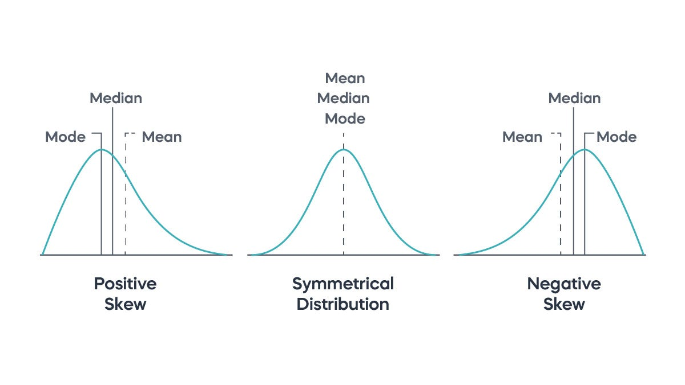
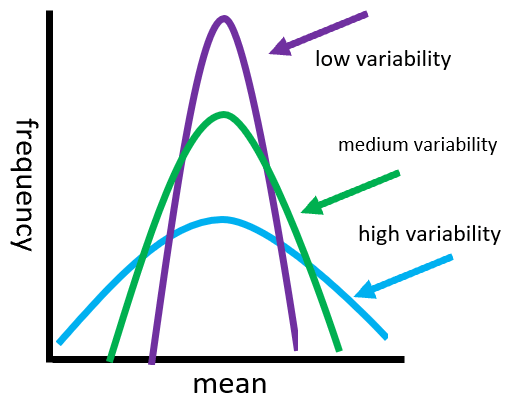
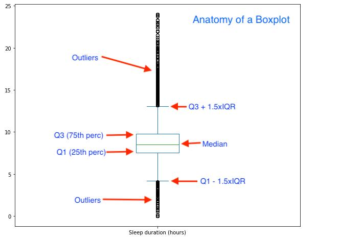
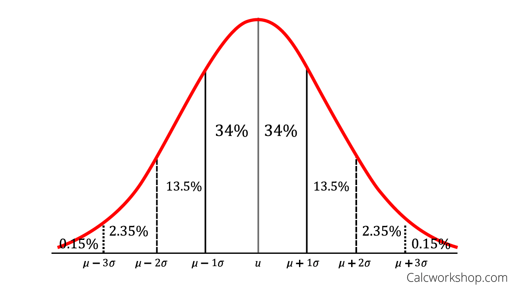

Part of [[course-data-science-bootcamp-12|Course: Data Science Bootcamp #12]]

And [[data-science|Data Science]]

# Research Design

เรียนสถิติต้องเข้าใจคำว่า 

**Research Design**

Random & Representative

- Random = สุ่มตัวอย่างเพื่อทดสอบจากทั้งหมด คิดจากการสุ่มโดนจะมีโอกาสเท่ากัน
	- เช่น หวย มีโถที่ข้างในมีลูกบอล 0-9 จะมีโอกาสถูกหยิบเท่ากัน
- Representative = การสุ่มจะมีหน้าตาคล้ายกับทั้งหมด
	- เช่น เลือกประชากร 2000 ตน มีโปรไฟล์คล้ายกันกับประชากรทั้งหมด

เราต้องเลือกสุ่มตัวอย่างที่ Random และ Representative ถึงจะได้ Data ที่ดี

ตัวอย่างที่ไม่ดี

ในปี 1936 นิตยสาร The Literary Digest สร้าง Poll ทำนายว่าใครจะชนะการเลือกตั้ง ระหว่าง **Alfred Landon vs Franklin D. Roosevelt** ตอนนั้นนิตยสารส่งจดหมายให้ผู้อ่านช่วยทำแบบทดสอบถาม 2.4 ล้านคน ส่วนใหญ่เทไปทาง Alfred Landon จึงตีพิมพ์ว่า Alfred จะชนะการเลือกตั้งอย่างแน่นอน

แต่ต่อมา คนที่ชนะการเลือกตั้งจริง ๆ คือ Franklin D. Roosevelt

 และหลังจากนั้น นิตยสารเจ้านี้ก็เจ๊งไป

จำนวนก็เยอะ แต่ทำไมผลกลับออกมาตาลปัตรขนาดนั้น

คำตอบคือ นิตยสารในยุคนั้นเป็นของคนที่มีเงิน ดังนั้นกลุ่มคนอ่านที่นิตยสารนั้นส่งให้ทำโพลจะเป็นคนที่มีเงิน ซึ่งเชียร์พรรคที่มีภาพลักษณ์เป็นคนมีเงินมากกว่า ผลโพลจึงไม่ Random และ Represent ในชีวิตจริงขนาดนั้น

> **Quality** of our sample is of paramount importance 

Sample = กลุ่มตัวอย่าง

Sampling = การเลือกสุ่มตัวอย่าง

Inference = Make decision to a population

เราใช้ในชีวิตจริงมาตลอด

เราทำน้ำซุป จะรู้ว่าน้ำซุปที่เราทำอร่อยมั้ย เราจะทำ Sampling โดยการคนๆ และตักชิมหนึ่งช้อน ถ้าอร่อย เราจะ Inference คิดว่าน้ำซุปทั้งถ้วยอร่อย

เรื่องหุ้น เราตัดสินใจซื้อจาก Data ที่เราอ่าน เราทำ Sampling เลือก Data ดูและ Inference คิดว่าหุ้นน่าซื้อหรือไม่

# The Descriptive Statistic

## Central Tendency = ค่ากลาง

Mean, Median, Mode

เราเลือก 3 ตัวหาค่ากลาง ตัวไหนก็ได้

แต่ถ้าเป็น Mean, Mode จะคำนวณคลาดเคลื่อนถ้า

Negative Skew = กราฟเบ้ซ้าย

Positive Skew = กราฟเบ้ขวา

ถ้ากราฟเป็นแบบนี้ ใช้ Median จะได้ตรงกลางพอดี

ใช้ Mean ในกรณีที่เป็น Normal Distribution

ส่วน Mode จะใช้หาจำนวนข้อมูลที่เกิดซ้ำมากสุด

## Variability = การกระจายตัวของข้อมูล

วัดจาก

Variance, SD ( Standard deviation)

SD = square Root of Variance

ใช้บอกว่า “ข้อมูลกระจายออกจากค่าเฉลี่ยแค่ไหน”

ถ้าเป็นกราฟ จะเป็นค่าแกน x

## Boxplot ดูการกระจายตัวของข้อมูล

(From: https://uoftcompdsci.github.io/ggr274-20251/weekly-materials/week05/lecture/Class5_GGR274_MM.html?utm_source=chatgpt.com)

องค์ประกอบ

- **Median (Q2)** → เส้นกลางในกล่อง (ค่ากลางของข้อมูล)
- **Q1 (25%)** → ขอบล่างของกล่อง
- **Q3 (75%)** → ขอบบนของกล่อง
- **IQR (Interquartile Range)** → ช่วง Q3 - Q1 (ความกว้างของกล่อง)
- **Whiskers** → เส้นที่ยื่นออกไป (ช่วงข้อมูลปกติ)
- **Outliers** → จุดที่อยู่นอก whiskers (ค่าที่ผิดปกติ)

วิธีอ่าน

- กล่อง **ยาว** → ข้อมูลกระจายมาก
- กล่อง **สั้น** → ข้อมูลกระจุกตัว
- เส้น median **ไม่อยู่กลางกล่อง** → ข้อมูล skew (เอียง)
- มีจุด outliers → มีค่าที่โดดออกจากกลุ่ม

## Z-score = ค่ามาตรฐาน

(x - mean) / SD

x = ข้อมูลดิบที่สนใจ

เราจะมี Column ข้อมูลดิบ เราเปลี่ยนเป็น Z-score Column

Z-Score จะบอกว่า ข้อมูลนี้ต่ำกว่าหรือสูงกว่าค่าเฉลี่ย

z = 0 → อยู่ตรงค่าเฉลี่ยพอดี
z > 0 → มากกว่าค่าเฉลี่ย
z < 0 → น้อยกว่าค่าเฉลี่ย
|z| มาก → ยิ่งไกลจากค่าเฉลี่ย (อาจเป็น outlier)

## Empirical Rule

ถ้าข้อมูลเป็นโค้งปกติ (Normal distribution):

- **68.2%** ของข้อมูล อยู่ในช่วง  
    ค่าเฉลี่ย ± 1 ส่วนเบี่ยงเบนมาตรฐาน (μ ± 1σ)
- **95%** ของข้อมูล อยู่ในช่วง  
    μ ± 2σ
- **99.7%** ของข้อมูล อยู่ในช่วง  
    μ ± 3σ

μ (มิว)  คือ ค่าเฉลี่ย (mean)

σ (ซิกมา)  คือ ส่วนเบี่ยงเบนมาตรฐาน (standard deviation)