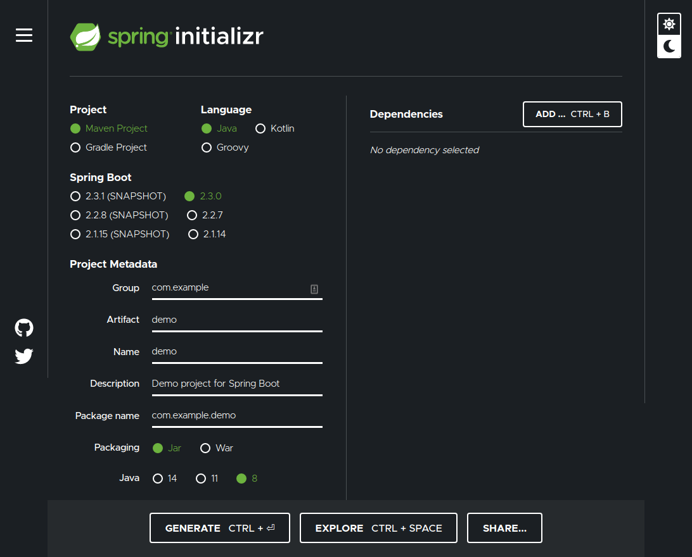
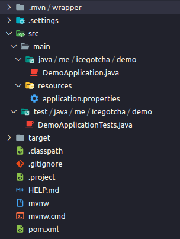
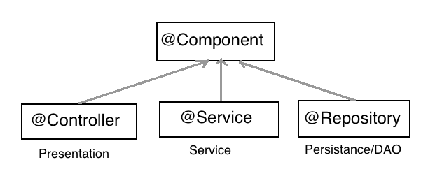
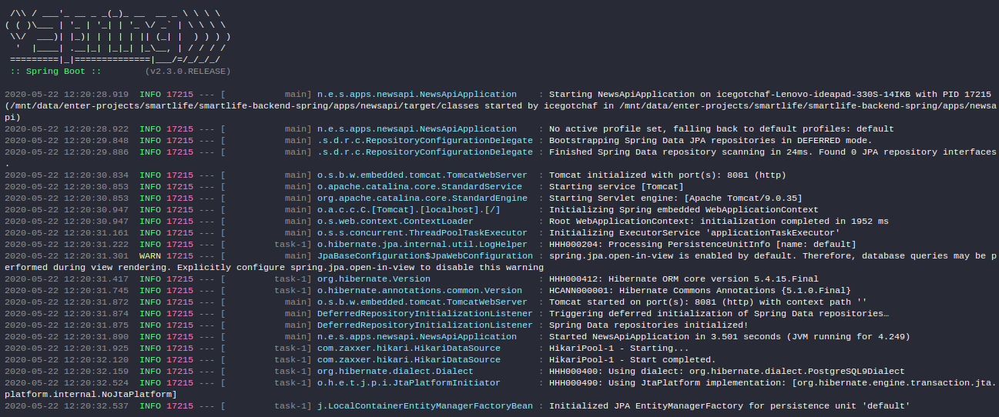
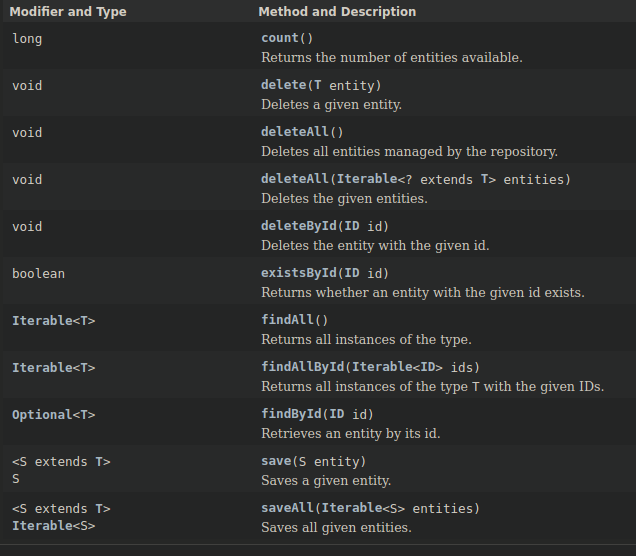

# [Java] Spring

# ความรู้ Java แบบเร็ว ๆ

- ทุกสิ่งทุกอย่างของ Java เป็น Class — แม่แบบ
- Class ประกอบด้วย Member instance และ Methods — ตัวแปรและฟังก์ชัน
- เราต้องสร้าง Object เพื่อใช้งานตัวแปรและฟังก์ชันต่าง ๆ — วัตถุที่หล่อขึ้นจากแม่แบบ

```java
ClassOne objectClassOne = new ClassOne();
```

- ถ้า Member Instance และ Method เป็น static สามารถใช้จาก Class โดยตรงไม่ต้องสร้าง Object ก่อน
- Data Type ใน Java แบ่งออกเป็น 2 ประเภท
    - **Primitive Data Type** — เก็บข้อมูลง่าย ๆ
        - ตัวเลข — byte, short, int, long, float, double
        - ตัวอักษร — char
        - boolean
    - **Object Type** — ก็คือทุกอย่างที่เป็น Class ต้องสร้างด้วย  "new" เช่น String, Integer, BigInteger, etc. รวมถึง Class ที่สร้างขึ้นมาเอง
- String เป็น Object ชนิดเดียวที่ไม่ต้อง `new String()` — `String greet = "Hello";`
- int และ Integer ต่างกันตรงไหน? — int เป็น Primitive ไม่ใช่ Class แต่ Integer เป็น Class ต้องสร้างด้วย "new" แต่สร้างแล้วจะต้องเพิ่ม Process ในการคำนวณ + - * / ถ้าใช้คำนวณทั่วไป ใช้ Primitive จะดีกว่า
- พวก Byte, Integer, Long ที่เป็น Class จะเป็น Wrapper Class มี static method ช่วยอำนวยความสะดวก เช่น เปลี่ยน String เป็น Integer ด้วยคำสั่ง `Integer.parseInt(String)`
- การสร้าง Array เราสร้างโดยใช้ `[]`

```
int[] arr = new int[10]; //สร้างarrayของintขนาด 10 ตัว

int[] arr = new int[]{1,2,3,4,5,6,7,8,9,10}; //สร้างarrayของint ตั้งแต่ 1-10 (ไม่ต้องบอกขนาดก็ได้ เพราะJavaจะนับให้เองเลย)

int[] arr = {1,2,3,4,5,6,7,8,9,10}; //หรือจะเขียนย่อๆ แบบนี้ก็ได้

//สำหรับตัวแปรประเภทอื่นก็สร้างคล้ายๆ กัน แต่เปลี่ยนชนิด
String[] nameList = new String[10];

//และถ้าอยากได้ขนาดของ array ว่ามีกี่ช่องจะใช้ .length (อย่าจำสับสนกับ .length() ของ String นะ ตัวนั้นจะมีวงเล็บต่อท้าย)
arr.length
```

ข้อสังเกตคือ array ในภาษานี้ถือว่ามีสภาพเป็น pointer ตัวหนึ่ง ดังนั้นก่อนจะใช้งานจะต้อง `new` ก่อนใช้งานเสมอ ถ้าลืมละก็ พังแน่นอนนะ

```
int[] arr;
arr[0] = 1;

```

แบบนี้พังแน่นอน จะขึ้นแจ้งเตือนว่า NullPointerException นะ

แต่นอกจากเขียนแบบนี้ เรามีวิธีเขียน array อีกแบบคือแบบผสม แบบนี้

```
int[] arr1, arr2, arr3;
//แน่นอนว่าอย่าลืม new ก่อนใช้ด้วยนะ
arr1 = new int[10];
arr2 = new int[10];
arr3 = new int[10];

//หรืออีกแบบนึง จะสลับข้าง [] แบบนี้ก็ได้นะ
int arr[] = new int[10]; 

//แต่ข้อควรระวังคือ...
int x[], y, z;
//แบบนี้ตัว x ถือว่าเป็น array แต่ y, z นั้นถือว่าเป็นแค่ int ธรรมดา
```

array ใน Java ถือว่ามีขนาดแบบฟิกตายตัว ถ้าประกาศ 10 ช่อง ก็ใช้ได้แค่ 10 ช่อง (index 0-9) ไม่สามารถขยายขนาดได้ ถ้าใช้เกินจะเจอ ArrayIndexOutOfBoundException นะ

และสำหรับ Array นั้นจะมีคลาสช่วยเหลือ (helper class) ชื่อว่า `Arrays` เอาไว้จัดการ Array ได้ เช่นการ sorting (เรียงลำดับข้อมูล) แบบนี้

```
int[] arr = {3,8,1,6,7,2,9,4,0,5};
Arrays.sort(arr);
//ตอนนี้ arr จะมีค่า {0,1,2,3,4,5,6,7,8,9}
```

เนื่องจาก array ไม่สามารถขยายขนาดได้
สำหรับข้อมูลชนิดที่เราไม่รูปขนาดตายตัวจะใช้ array ยากมาก
ดังนั้นเลยมีการสร้างข้อมูลชนิด List ขึ้นมา
โดยวิธีการใช้จะต้องเลือกว่าจะสร้างด้วย ArrayList หรือ LinkedList แบบนี้

```
List<Integer> data = new ArrayList<>();
//หรือ
List<Integer> data = new LinkedList<>();
```

ซึ่งวิธีการใช้จะต่างกับ array แบบปกติดังนี้

```
List<Integer> data = new ArrayList<>();

data.set(0,100);
//จะเหมือนกับ data[0] = 100

System.out.println(data.get(0));
//จะเหมือนกับ System.out.println(data[0]);

data.size();
//จะเหมือนกับ data.length

data.add(200);
//อันนี้ array ไม่มี ใช้สำหรับเพิ่มข้อมูลเข้าไปใน array ช่องสุดท้าย (ต่อท้าย) ตัว List จะขยายขนาดขึ้นเองอัตโนมัติ
```

แต่เนื่องจาก List นั้นไม่ใช่ array แท้ๆ (มันเป็น class ที่สร้างขึ้นมาเอง)
เราเลยต้องมีการบอกด้วยว่าข้อมูลในลิสต์นี้เป็นชนิดอะไรด้วยการใส่ generic ลงไป 

### foreach

Java มี for แบบพิเศษที่เอาไว้วนลูป array (และ List ด้วย) แบบไม่ต้องนับเอง

ปกตินั้นถ้าเรามี array อยู่ ถ้าอยากวนลูปทุกตัวจะเขียนประมาณนี้

```
int[] arr = {1,2,3,4,5};
for(i=0; i<arr.length; i++){
    System.out.println(arr[i]);
}

//หรือแบบนี้

List<Integer> arr = new ArrayList<>();
for(i=0; i<arr.size(); i++){
    System.out.println(arr.get(i));
}

```

เราต้องเขียนเงื่อนไขและสร้างตัวนับ i ด้วยตัวเอง แต่ถ้าเราเขียนแบบ foreach จะเหลือแค่นี้

```
int[] arr = {1,2,3,4,5};
for(int e : arr){
    System.out.println(e);
}

//หรือแบบนี้

List<Integer> arr = new ArrayList<>();
for(int e : arr){
    System.out.println(e);
}

```

วิธีการใช้คือให้เราสร้างตัวแปรสำหรับเป็นตัวแทนข้อมูลขึ้นมา 1 ตัว แช่นในตัวอย่างเป็นการวนลูป array ของ int เลยสร้าง `int e` ขึ้นมา (ใช้ชื่ออะไรก็ได้นะ) ตัวแปรตัวนี้จะมีค่าเท่ากับการใช้ `arr[i]` แบบการวนลูป array ปกติ แค่เราไม่ต้องเขียนเงื่อนไขนับด้วยเองเท่านั้น การวนลูปแบบนี้เรียกว่าการวนแบบ foreach

# Get Started

สร้าง Project ที่ [Spring Initializr](https://start.spring.io/) และเปิดใน IDE

- **Visual Studio Code**
    - Setup และลง Extension — [https://code.visualstudio.com/docs/languages/java](https://code.visualstudio.com/docs/languages/java)
- **InteliJ**
- **Eclipse**

## การสร้าง Project ด้วย Spring Initializr



### Project

เลือก Project & Dependency Management ที่จะใช้งาน ในที่นี้จะเลือกใช้ Maven

### Language

 เลือกภาษาโปรแกรมที่เราจะใช้ทำงานกับ Spring ในที่นี้จะใช้ Java

### Spring Boot

เลือกเวอร์ชันของ Spring Boot ที่เป็นตัวรันแอปพลิเคชัน Spring

### Project Metadata

- **Group**
    
    กลุ่มที่แอปพลิเคชันจะอยู่ ส่วนมากเป็นโดเมนเนมที่เริ่มต้นด้วย extension ตามด้วยชื่อและซับโดเมน
    
    
    
    ตามตัวอย่าง หากเราจะใช้ Group นี้ เราควรพิมพ์ว่า `com.magicworkshost` (ไม่ต้องมี www)
    
- **Artifact**
ชื่อเรียกของแอปพลิเคชันที่ต่อจาก Group เช่น `myapp` เมื่อเราจะอ้างอิงแอปพลิเคชันใน Java เราจะเรียกใช้เป็น `{group}.myapp` เช่น `com.magicworkshost.myapp`
- **Name / Description**
ชื่อแอปพลิเคชัน และรายละเอียดของแอปพลิเคชัน สามารถใช้ตัวพิมพ์เล็กตัวพิมพ์ใหญ่ และเว้นวรรค
- **Package Name**
ชื่อ Package ที่เราจะใช้เป็นชื่ออ้างอิงตอนเรียกใช้แอปพลิเคชีย ส่วนมากจะอยู่ในรูปแบบ
 `{group}.{artifact}`
- **Packaging**
หากเราเลือก Packaging เป็น **Jar** มันจะมี [Tomcat](http://tomcat.apache.org/) เป็น Server ทำงานอยู่เป็นเบื้องหลังติดมา เราไม่ต้องหา Server และตัวช่วยอื่น ๆ มาติดตั้งก่อนรันแอปพลิเคชัน แต่หากเราเลือก **War** เราจะได้ตัวรันแอปพลิเคชันเพียว ๆ ไม่มี Server ติดมาด้วย เราต้องหา Server มาใช้งานเอง
- **Java**
เลือกเวอร์ชันของ Java Compiler ที่จะใช้ Compile ตัวแอปพลิเคชันนี้

### Dependencies

เลือก Library ที่เราจะใช้งาน ส่วนมากถ้าจะทำ REST API จะต้องมี **Spring Web** ด้วยเสมอ

# โครงสร้างของ Project

## Started Structure

- **`src`** — Source Code
    - **`main`** — ที่เก็บ Source code โปรแกรม ภายในจะมีไฟล์ชื่อ `{AppName}Application.java` เป็นตัวเริ่มการทำงานของแอปพลิเคชัน
    - **`test`** — ที่เก็บ Source Code รัน Test
    - **`resources`** — ที่เก็บไฟล์ต่าง ๆ ที่ใช้ในโปรแกรม เช่น ไฟล์ Text, ไฟล์ Binary, ไฟล์รูปภาพ รวมไปถึง Library และไฟล์ Config ต่าง ๆ ภายในโฟลเดอร์นี้มีไฟล์ที่สำคัญคือ `application.properties` ทำหน้าที่เก็บตัวแปรต่าง ๆ ไว้ใช้ในโปรแกรม เหมือน `.env` ใน Laravel Project และ Node.js
- **`mvnw` / `mvnw.cmd`** — ไฟล์ของ Spring Boot เป็นตัวรันแอปพลิเคชัน
- **`pom.xml`** — ไฟล์สำคัญของโปรเจคที่ใช้ Maven เก็บข้อมูลทั่วไปของ App เช่น Artifact, Name, Description รวมถึง Dependency (ถ้าเลือกเป็น Gradle จะเป็นไฟล์อีกแบบ)



## Structure for REST API

เราสามารถใส่ Source Code ในโฟลเดอร์ `src/main` เท่านั้น การแยกการเก็บไฟล์ต่าง ๆ จะใช้ระบบ Package ของ Java มาช่วย

**Package** คือการจัดหมวดหมู่หรือแบ่งแยกคลาสให้เป็นกลุ่ม ซึ่งเรียกว่า namespaces เพื่อให้โครงสร้างของโปรแกรมมีระเบียบ ง่ายต่อการเขียนและอ่านโค้ดโปรแกรม

เรามักจะตั้งชื่อ Package ให้อยู่ในรูปของ `<group>.<artifact>.<part>` ยกตัวอย่างเช่น `com.example.app.controller` (group คือ `com.example` artifact คือ `app` part คือ `controller`)

ตัวอย่าง `<part>`

- **controller** — เก็บพวก API Operation ต่าง ๆ
- **service** — เก็บพวก Business Logic ต่าง ๆ
- **model/entity** — เก็บพวก Data Model หรือ Class ที่เก็บข้อมูลเป็นโครงสร้าง เพื่อใช้ในโอกาสต่าง ๆ เช่น ใช้เป็น Request Body, Response Body หรือส่งไปเก็บใน Database (Class ที่ใช้การนี้จะถูกเรียกว่า Entity) เป็นต้น
- **repository** — เก็บพวก Database CRUD Function
- **util** —  เก็บฟังก์ชันช่วยต่าง ๆ ที่ไม่เกี่ยวกับ Business Logic เช่น Validation

โดยปกติ Spring ไม่มีการกำหนดโครงสร้างที่ตายตัว แต่นี่เป็น Best Practice ข้อหนึ่งของการทำ REST API ที่ดีใน Spring

สำหรับ `src/test` จะนิยมแบ่ง Package เป็นแบบเดียวกับ `src/main`

# Run Application

```bash
./mvnw spring-boot:run
```

เมื่อพิมพ์คำสั่งด้านบนนี้ Spring Boot จะเริ่มทำงาน มันจะดาวน์โหลดและติดตั้ง Dependency และให้แอปพลิเคชันทำงานอัตโนมัติ ถึงตอนนี้เราสามารถเข้าไปใช้งานผ่าน [`http://localhost:8080`](http://localhost:8080) ได้เลย

หากเราต้องการให้หยุดทำงาน สามารถทำได้โดยกดคีย์ Ctrl + C ที่ Command Line ที่พิมพ์คำสั่งนี้

# การสร้าง API Endpoint

ใน Spring กลุ่ม Class ทุกตัวที่เป็น Controller จะทำหน้าที่ Handle HTTP Request ซึ่ง Controller Class ทุกตัวจะต้องมี Annotation `@RestController` กำกับไว้

```java
import java.util.concurrent.atomic.AtomicLong;
import org.springframework.web.bind.annotation.GetMapping;
import org.springframework.web.bind.annotation.RequestParam;
import org.springframework.web.bind.annotation.RestController;
import me.icegotcha.demo.model.Greeting;

@RestController
public class GreetingController {
	private static final String template = "Hello, %s!";
	private final AtomicLong counter = new AtomicLong();

	@GetMapping("/greeting")
	public Greeting greeting(@RequestParam(value = "name", defaultValue = "World") String name) {
		return new Greeting(counter.incrementAndGet(), String.format(template, name));
	}
}
```

และ Method ต่าง ๆ ใน Class นั้น หากมี Annotation เหล่านี้กำกับไว้ จะถือว่าเป็น API Operation

- `@GetMapping` — HTTP GET request
- `@PostMapping` —  HTTP POST request
- `@PutMapping` —  HTTP PUT request
- `@PatchMapping` — HTTP PATCH request
- `@DeleteMapping` —  HTTP DELETE request
- `@RequestMapping` — ใส่ `method = RequestMethod.<HTTP verb>` ใน Parameter เช่น `@RequestMapping(value="/hello", method = RequestMethod.GET)`

ยกตัวอย่าง การใช้ Annotation กลุ่ม Mapping: เมื่อรัน API จะสามารถเข้าถึง URI `/greeting` ได้

```java
@GetMapping("/greeting")
public Greeting greeting(@RequestParam(value = "name", defaultValue = "World") String name) {
	return new Greeting(counter.incrementAndGet(), String.format(template, name));
}
```

เราสามารถใช้ `@RequestMapping` ที่ Controller เพื่อกำหนด URL Prefix สำหรับ Controller นี้ เช่น `/user` สำหรับ User Controller

```java
@RestController
@RequestMapping("/user")
class UserAPI {
  @RequestMapping(method = RequestMethod.POST)
  public User create(User user) {
    // Process the user.
    // Possibly return the same user, although anything can be returned.
    return user;
  }
```

## การรับค่าจาก Request

เราสามารถรับค่าจาก HTTP Request ได้ โดยกำหนด Parameter ใน Method นั้น (`type varName`) แต่ละ Parameter จะต้องมี Annotation กำกับอยู่ข้างหน้าด้วยว่ารับทางใด

### Query Parameters

ใช้ Annotation `@RequestParam` กำกับ 

```java
@GetMapping("/api/foos")
public String getFoos(@RequestParam String id) {
    return "ID: " + id;
}
```

ตัวอย่างนี้ หากเข้า URI  `/api/foos?id=abc` จะได้ตัวแปร id ที่มีค่าเท่ากับ abc

Annotation นี้มี Option ให้กำหนดได้  ตัว

- **name** — กำหนดชื่อ Parameter ที่จะให้ใส่ใน URI
- **value** — อีกชื่อหนึ่งของ Option name
- **required** — กำหนดเป็น `true` ให้บังคับใส่ กำหนดเป็น `false` ให้มันเป็น Optional Parameter หากไม่ใส่ Parameter นั้นมา ค่าของตัวแปรจะเป็น Null
- **defaultValue** — ค่าที่ให้โปรแกรมใส่อัตโนมัติเมื่อไม่ใส่ค่าของ Parameter นั้นมา

ตัวอย่างการกำหนด Option

```java
@GetMapping("/greeting")
public Greeting greeting(@RequestParam(value = "name", required='false', defaultValue = "World") String name) {
	return new Greeting(counter.incrementAndGet(), String.format(template, name));
}
```

ข้อมูลเพิ่มเติม

[Spring @RequestParam Annotation | Baeldung](https://www.baeldung.com/spring-request-param)

### Path Parameters

ใช้ Annotation `@PathVariable` กำกับ

```java
@GetMapping("/user/{id}")
public String handleRequest(@PathVariable("id") String userId) {}
```

จากตัวอย่าง หากเข้า `user/123` จะได้ค่าตัวแปร userId เท่ากับ 123

Annotation นี้มี Option ให้กำหนดได้ 3 ตัว

- **name** — กำหนดชื่อ Parameter ที่จะให้ใส่ใน URI
- **value** — อีกชื่อหนึ่งของ Option name
- **required** — กำหนดเป็น `true` ให้บังคับใส่ กำหนดเป็น `false` ให้มันเป็น Optional Parameter หากไม่ใส่ Parameter นั้นมา ค่าของตัวแปรจะเป็น Null

ข้อมูลเพิ่มเติม

[Spring Optional Path Variables | Baeldung](https://www.baeldung.com/spring-optional-path-variables)

### Request Body

การรับข้อมูลมาจาก Request Body มี 2 วิธี

**วิธีที่หนึ่ง** ใช้ Annotation `@RequestBody` สำหรับรับข้อมูลเป็น `application/json` วิธีนี้เราต้องสร้าง Class ที่แสดงถึงโครงสร้างของ Request Body ที่เราจะรับเข้ามา และนำมาทำเป็น Object ที่คอยรับข้อมูล อย่างเช่น เราจะ Implement API Endpoint `/login` ที่รับข้อมูลจาก Request Body 2 ตัวคือ username และ password เราต้องสร้าง Class หน้าตาแบบนี้ก่อน

```java
public class LoginForm {
    private String username;
    private String password;
    // ... ฟังก์ชัน Getters และ Setters
}
```

การรับข้อมูล

```java
@PostMapping("/request")
public ResponseEntity<?> postController(@RequestBody LoginForm loginForm) {
    exampleService.fakeAuthenticate(loginForm);
    return ResponseEntity.ok(HttpStatus.OK);
}
```

**วิธีที่สอง** ใช้ Annotation `@RequestParam` สำหรับรับข้อมูลที่ส่งมาเป็น `application/x-www-from-urlencoded` และ `form data`

ตาม Document ของ Spring ที่ว่า

> In Spring MVC, "request parameters" map to query parameters, form data, and parts in multipart requests. This is because the Servlet API combines query parameters and form data into a single map called "parameters", and that includes automatic parsing of the request body.
> 

Annotation นี้ เราต้องใช้กับตัวแปรที่เก็บข้อมูลเดียว เช่น

```java
@PostRequest("/api/user")
public User register(
	@RequestParam("name") String name,
	@RequestParam("email") String email,
	@RequestParam("password") String password,
	@RequestParam("age") int age
) {
	//...
}
```

หรือใช้กับตัวแปรประเภท `Map<...,...>`

```java
@PostRequest("/api/user")
public User register(@RequestParam Map<string,Object> requestBody) {
	String name = (String) requestBody.get("name");
	//...
}
```

ข้อมูลเพิ่มเติมเกี่ยวกับ RequestParams

[Spring @RequestParam Annotation | Baeldung](https://www.baeldung.com/spring-request-param)

### Header

ใช้ Annotation `RequestHeader` กำกับ

```java
public String handleRequestByTwoHeaders(@RequestHeader("User-Agent") String userAgent,
                                        @RequestHeader("Accept-Language") String acceptLanguage,
                                        Model map) {
    map.addAttribute("msg", "Trade request by User-Agent and Accept headers : " +
                     userAgent + ", " + acceptLanguage);
    return "my-page";
}
```

ข้อมูลเพิ่มเติม

[Spring MVC - @RequestHeader Examples](https://www.logicbig.com/tutorials/spring-framework/spring-web-mvc/spring-mvc-request-header.html)

## การ Response ส่งค่าออกไป

Spring จะแปลงค่าที่ Method Return ออกมาให้ตามความเหมาะสมอัตโนมัติ ด้วยความสามารถของ Annotation `@RestController`

- ถ้า Return เป็น String ก็จะ Response เป็นข้อความ
- ถ้า Return เป็น Object ก็จะ Response เป็น JSON

กรณีที่จะ Return เป็น object เราควรสร้าง Class ที่มีลักษณะดังตัวอย่าง

```java
public class Greeting {
	private final long id;
	private final String content;

	public Greeting(long id, String content) {
		this.id = id;
		this.content = content;
	}

	public long getId() {
		return id;
	}

	public String getContent() {
		return content;
	}

}
```

เมื่อจะ Return ก็ให้ Return เป็น Object ออกมาเลย

```java
@GetMapping("/greeting")
public Greeting greeting(@RequestParam(value = "name", defaultValue = "World") String name) {
	return new Greeting(counter.incrementAndGet(), String.format(template, name));
}
```

หากไม่ใช้ Annotation `@RestController` (ใช้ `@Controller` แทน) ต้องกำกับ Method ทุกตัวด้วย `@ResponseBody` เสมอ เช่น

```java
@GetMapping("/greeting")
@ResponseBody
public Greeting greeting(@RequestParam(value = "name", defaultValue = "World") String name) {
	return new Greeting(counter.incrementAndGet(), String.format(template, name));
}
```

การ Response อีกแบบหนึ่งที่ทำได้ ก็คือ การใช้ ResponseEntity ซึ่งเปิดโอกาสให้เราปรับ HTTP Status, Response Header ได้ตามที่ต้องการ

```java
@GetMapping("/hello")
ResponseEntity<String> hello() {
    return new ResponseEntity<>("Hello World!", HttpStatus.OK);
}
```

ตัวอย่างการคืนค่าเป็น Response Entity ที่ซับซ้อนขึ้น

```java
@GetMapping("/hi")
public ResponseEntity<Map<String, String>> hi() {
	Date date = new Date();
	String currentTime = date.toString();	
	String message = currentTime + " :: OK!";
	logger.info(message);
	
	HashMap<String, String> map = new HashMap<>();
	map.put("Time", currentTime);
	map.put("Message", "Hi");
	
	HttpHeaders header = new HttpHeaders();
	header.setContentType(MediaType.APPLICATION_JSON);
	return ResponseEntity.ok().headers(header).body(map);
}
```

เพิ่มเติมเกี่ยวกับ Response Entity

[Using Spring ResponseEntity to Manipulate the HTTP Response | Baeldung](https://www.baeldung.com/spring-response-entity)

## การ Handle Multipart

หาก Request นั้นมีการรับไฟล์เข้ามา Parameter ที่รับข้อมูลไฟล์นั้นจะต้องมี Type เป็น `MultipartFile` (มาจาก org.springframework.web.multipart) 

```java
@PostMapping("/users/profile")
	public ResponseEntity<?> addUserProfile(
			@RequestParam("image") MultipartFile avatarImage, 
			@RequestParam("fullname") String fullname, 
			@RequestParam("bio") String bio
){
	// ...
}
```

## [Incomplete] การ Handle Error

มี 2 วิธีที่ใช้กันอยู่ตอนนี้

**วิธีที่ 1** ใช้ @ControllerAdvice 

**วิธีที่ 2** ใช้ ResponseStatusException

[TODO]

[Error Handling for REST with Spring | Baeldung](https://www.baeldung.com/exception-handling-for-rest-with-spring)

# การสร้าง Service Class

ใน Spring มี annoation `@Service` เอาไว้แสดงว่า Class นี้ทำหน้าที่เป็น Service ซึ่ง Service ในที่นี้ใช้เขียน Business Logic แยกออกจากชั้น Controller

```java
@Service
public class ProductService {
	// ... Methods ...
}
```

การใช้ Service ที่ Controller หรือ Class อื่น ก็ใช้ `@Autowired` กำกับตัวแปรเพื่อให้ Spring สร้าง Object จาก Class ด้วยวิธีการที่เรียกว่า Dependency injection

```java
@RestController
public class ProductController {
	@Autowired
	private ProductService service;

	// ... Controller Methods ...
}
```

# Dependency Injection

ปกติ ถ้าเราต้องการจะสร้าง Object ใน Class หนึ่ง เราจะ Assignment ใน Constructor แบบนี้

```java
public class ClassOne {
	private DatabaseClass db = new PostgresSQLClass();
	
	// ...methods...
}
```

มันจะมีปัญหา ก็คือ

- ทำให้มี 2 Class ที่ผูกมัดกัน
- ยากที่จะเปลี่ยน Object ไปเป็นตัวอื่น เช่น หากเราต้องการเปลี่ยนไปใช้ Test Database เพื่อทำ Unit test เราจะทำไม่ได้

วิธีแก้ปํญหาก็คือ

- สร้าง Constructor อีกตัวหนึ่งที่รับ Object เข้ามา
- สร้าง Setter

```java
public class ClassOne {
	private DatabaseClass database = new PostgresSQLClass(); // ให้เป็น default value
	
	// constructor
	public ClassOne(DatabaseClass db) {
		this.database = db;
	}

	// setter
	public void setDatabase(DatabaseClass db) {
		this.database = db;
	}
	
	// ...other method
}
```

แต่  Spring มีวิธีง่ายกว่านั้น เราสามารถใช้ Annotation `@Autowired` กำกับตัวแปรเพื่อให้ Spring ทำการสร้าง Object อัตโนมัติเลย

```java
@Component 
public class ClassOne {
	@Autowired
	private DatabaseClass database
}
```

แต่จะทำแบบนั้นได้ ต้องทำให้ Class ทั้งสองคลาสเป็น Component ของ Spring ก่อน (`@Component`, `@Service`, `@Repository`, `@Controller`) 

# Component ของ Spring



Spring มีกลไกช่วยสแกนหาคลาสต่าง ๆ ที่เป็นถูก Mark เป็น Component และเรียกใช้อัตโนมัติ โดยที่เราไม่ต้องเขียนโค้ดเพื่อ Import สร้าง Object ใช้เอง

Component ของ Spring จะแบ่งเป็น Annotation ดังนี้

- `@Component` — Component ทั่วไป
- `@Controller` — Component ที่เป็น Controller ทำหน้าที่เปิดใช้งาน API ต่าง ๆ
- `@Service` — Component ที่เป็น Service ทำหน้าที่ทำงานตาม Business Logic
- `@Repository` — Component ที่เป็น Repository ทำหน้าที่ CRUD กับฐานข้อมูลแบบต่าง ๆ

# การเชื่อมต่อกับ Database

การเชื่อมต่อกับ Database ใน Spring มีขั้นตอนดังต่อไปนี้

- ลง Dependency ที่เกี่ยวข้อง
- เพิ่มข้อมูลการเชื่อมต่อ Database
- สร้าง Database Entity
- สร้าง Entity CRUD Repository
- เรียกใช้งาน

ในที่นี้จะใช้ Spring JPA + Hibernate เชื่อมต่อกับ Postgresql

## ลง Dependency

ให้เพิ่มข้อมูลนี้ลงที่ส่วนของ `<dependencies>` ในไฟล์ `pom.xml`

```xml
<dependency>
	<groupId>org.springframework.boot</groupId>
	<artifactId>spring-boot-starter-data-jpa</artifactId>
</dependency>

<dependency>
	<groupId>org.postgresql</groupId>
	<artifactId>postgresql</artifactId>
	<scope>runtime</scope>
</dependency>
```

จากโค้ดจะเห็นว่า เราได้ลง Dependency เพิ่ม 2 ตัวคือ

- **spring-boot-starter-data-jpa** — Spring JPA (Java Persistence API) คือ ตัวที่ช่วยจัดการข้อมูลใน ฐานข้อมูล โดยมี Hibernate ซึ่งเป็น ORM ทำงานอยู่เบื้องหลัง
- **org.postgresql** —  PostgreSQL JDBC Driver มันคือ [JDBC Driver](https://en.wikipedia.org/wiki/JDBC_driver) ของ Postgresql ตัวที่ช่วยเชื่อมต่อ Database เข้ากับ Application ของเรา หากเราใช้ Database ตัวอื่น เช่น MySQL, MariaDB ก็ต้องหา JDBC Driver ของตัวนั้น ๆ มาใช้แทน

หลังจากการเพิ่ม Dependency เราจะไม่สามารถรัน Application ได้ เนื่องจากไม่พบข้อมูลที่จะให้เกิดการเชื่อมต่อ Database ได้นั่นเอง 

## เพิ่มข้อมูลการเชื่อมต่อ Database

ให้แก้ไข `application.properties` ที่อยู่ในโฟลเดอร์ `src/resources`  ให้มีข้อมูลดังนี้

```
spring.datasource.url=jdbc:postgresql://{host}:{port}/{database}
spring.datasource.username=justauser
spring.datasource.password=thisispassword
spring.datasource.driver-class-name=org.postgresql.Driver
spring.jpa.database-platform=org.hibernate.dialect.PostgreSQL9Dialect
spring.jpa.hibernate.ddl-auto=update
```

- **spring.datasource.url** — ที่อยู่ของ Database แทน `{host}`, `{port}`, `{database}` เป็น Address, Port, และชื่อของ Database ที่เราใช้อยู่ตามลำดับ
- **spring.datasource.username** — Username ที่เราติดต่อ Database
- **spring.datasource.password** — Password ที่เราติดต่อ Database
- **spring.datasource.driver-class-name** — ชื่อ Class ที่เป็น JDBC Driver
- **spring.jpa.database-platform** — ชื่อ Class ที่บอกว่าเราใช้ภาษา SQL ของอะไร เวอร์ชันใด (สามารถดู Class ที่ต้องใช้ได้ใน [Link นี้](https://docs.jboss.org/hibernate/orm/5.0/javadocs/org/hibernate/dialect/package-summary.html))
- **spring.jpa.hibernate.ddl-auto** — ตัวนี้เป็นควบคุมพฤติกรรมของ Hibernate ให้จัดการกับโครงสร้างของข้อมูลใน Database ตามที่เราสร้างเป็น Entity Class อย่างไรเมื่อแอปพลิเคชันเริ่มทำงาน โดยมีค่าและการทำงานของแต่ละค่าตาม [Reference นี้](https://docs.spring.io/spring-boot/docs/current/reference/html/howto.html#howto-database-initialization)
    
    <aside>
    💡 มีคำอธิบายการใช้งานจาก[กระทู้ StackOverflow](https://stackoverflow.com/questions/42135114/how-does-spring-jpa-hibernate-ddl-auto-property-exactly-work-in-spring) ดังนี้:
    
    For the record, the `spring.jpa.hibernate.ddl-auto` property is Spring Data JPA specific and is their way to specify a value that will eventually be passed to Hibernate under the property it knows, `hibernate.hbm2ddl.auto`.
    
    The values `create`, `create-drop`, `validate`, and `update` basically influence how the schema tool management will manipulate the database schema at startup.
    
    For example, the `update` operation will query the JDBC driver's API to get the database metadata and then Hibernate compares the object model it creates based on reading your annotated classes or HBM XML mappings and will attempt to adjust the schema on-the-fly.
    The `update` operation for example will attempt to add new columns, constraints, etc but will never remove a column or constraint that may have existed previously but no longer does as part of the object model from a prior run.
    
    Typically **in test case scenarios**, you'll likely use `create-drop` so that you create your schema, your test case adds some mock data, you run your tests, and then during the test case cleanup, the schema objects are dropped, leaving an empty database.
    
    **In development**, it's often common to see developers use `update` to automatically modify the schema to add new additions upon restart. But again understand, this does not remove a column or constraint that may exist from previous executions that is no longer necessary.
    
    **In production**, it's often highly recommended you use `none` or simply don't specify this property. That is because it's common practice for DBAs to review migration scripts for database changes, particularly if your database is shared across multiple services and applications.
    
    </aside>
    

เมื่อรัน Application จะเห็นว่ามีการเชื่อมต่อกับ Database ตามข้อมูลที่เรากรอก



## สร้าง Database Entity

เราจะกำหนด Schema หรือโครงสร้างข้อมูลของตาราง (Relation) ต่าง ๆ โดยสร้าง Entity เป็น POJO Class (Plain Old Java Object Class) หรือ Class ที่มีเพียง Field ข้อมูล (Instance Variable) และฟังก์ชัน Get/Set สำหรับ Field แต่ละตัว ตามตัวอย่าง

```java
mport java.util.Date;
import java.util.UUID;

import javax.persistence.Column;
import javax.persistence.Entity;
import javax.persistence.GeneratedValue;
import javax.persistence.GenerationType;
import javax.persistence.Id;
import javax.persistence.Table;

@Entity
@Table(name = "news")
public class News {
    @Id
    @GeneratedValue(strategy = GenerationType.AUTO)
    private UUID id;

    @Column(nullable = false, columnDefinition = "varchar(255)")
    private String category;

    @Column(nullable = false, columnDefinition = "text")
    private String title;

    @Column(nullable = false, columnDefinition = "longtext")
    private String content;

    @Column(name = "image", nullable = false, columnDefinition = "text")
    private String imageUrl;

    @Column(name = "created_at", nullable = false, updatable = false, columnDefinition = "timestamptz default CURRENT_TIMESTAMP")
    private Date createdAt;

    @Column(name = "created_by", nullable = false, updatable = false, columnDefinition = "varchar(255)")
    private String createdBy;

    public void setId(UUID id) {
        this.id = id;
    }

    public UUID getId() {
        return this.id;
    }

    public void setCategory(String category) {
        this.category = category;
    }

    public String getCategory() {
        return this.category;
    }

    public void setTitle(String title) {
        this.title = title;
    }

    public String getTitle() {
        return this.title;
    }

    public void setContent(String content) {
        this.content = content;
    }

    public String getContent() {
        return this.content;
    }

    public void setImageUrl(String imageUrl) {
        this.imageUrl = imageUrl;
    }

    public String getImageUrl() {
        return this.imageUrl;
    }

    public void setCreatedAt(Date createdAt) {
        this.createdAt = createdAt;
    }

    public Date getCreatedAt() {
        return this.createdAt;
    }

    public void setCreatedBy(String createdBy) {
        this.createdBy = createdBy;
    }

    public String getCreatedBy() {
        return this.createdBy;
    }
}
```

จากตัวอย่างจะเห็นว่า

- Class `News` จะมี `@Entity` และ `@Table` กำกับ
    - `@Entity` ใช้กำหนดว่า Class นี้เป็น Entity ที่แสดงถึงโครงสร้างข้อมูลใน Database
    - `@Table`  ใช้กำหนดว่า Entity นี้เป็นตารางใน Database สามารถใส่ชื่อตารางเพื่อให้โปรแกรมรู้ว่า เรากำลังอ้างอิงถึงตารางใดใน Database (หากไม่ใส่ จะถือว่ากำลังอ้างอิงถึงตารางชื่อเดียวกับ Entity)
- Instance Variable จะมีฟังก์ชัน Get/Set เป็นของตัวเอง
    - พวกนี้โปรแกรมจะถือว่าเป็น Column หรือ Attribute ของตารางนี้
    - สามารถมี `@Column` กำกับได้ ซึ่งสามารถกำหนดได้ว่า
        - ชื่อ Column ที่ใช้ใน Database เป็นอะไร? (`name="..."`)
        - รองรับค่า Null หรือไม่ (`nullable = true/false`)
        - สามารถเพิ่มค่าลงใน Column นี้ได้หรือไม่? (`insertable = true/false`)
        - สามารถแก้ไขค่าได้หรือไม่? (`updatable = true/false`)
        - ลักษณะของ Column เป็นอย่างไรในภาษา SQL? 
        (`columnDefinition = "timestamptz default CURRENT_TIMESTAMP"`)
- Instance Variable ที่เป็น Primary Key จะมี `@Id` กำกับ
    - สามารถกำหนดการ Generate ค่าของ Primary Key ผ่าน Annotation `@GeneratedValue` ในที่นี้กำหนด `strategy = GenerationType.AUTO` หมายความว่า มันจะเลือกวิธี Generate ค่าให้เองโดยยึดตามข้อกำหนดของ Database ที่ใช้ ทั้งนี้สามารถเปลี่ยนไปใช้ strategy อื่นได้ ลิงก์ข้างล่างจะเป็นบทความที่อธิบายการใช้งานของแต่ละ Strategy:
    
    [How to generate primary keys with JPA and Hibernate](https://thorben-janssen.com/jpa-generate-primary-keys/)
    

## สร้าง Entity CRUD Repository

หลังจากสร้าง Entity เรียบร้อย ขั้นตอนถัดไป เราจะต้องเตรียมฟังก์ชัน CRUD (Create, Read, Update, Delete) ให้กับ Entity ที่เราสร้างขึ้นด้วย โดยการสร้าง Interface จำพวก CRUD Repository ดังตัวอย่างโค้ดด้านล่าง

```java
import java.util.UUID;
import org.springframework.data.repository.CrudRepository;
import net.example.entity.News;

public interface NewsRepository extends CrudRepository<News, UUID> {}
```

หลังการสร้าง จะมีฟังก์ชันให้ใช้ดังนี้



จากรูปจะเห็นว่า มันประกอบด้วยฟังก์ชันที่ทำคำสั่ง Query ไม่ซับซ้อน หากเราต้องการฟังก์ชันที่มีการ Query ที่ซับซ้อนมากกว่านั้น เราต้องกำหนดภายใน Repository ที่เราสร้างขึ้นเอง โดยกำหนดเป็นหัวฟังก์ชันเท่านั้น (ไม่ต้องกำหนดการทำงานภายใน) การกำหนดชื่อฟังก์ชันจะมีข้อกำหนดอยู่ อย่างเช่น

- ถ้าต้องการฟังก์ชันที่ Query เป็น `SELECT * FROM {entity_table_name} WHERE {column} = ...` จะต้องกำหนดชื่อเป็น `findBy{Column}` เช่น
    
    ```java
    List<News> findByTitle(String title);
    ```
    
    ถ้าต้องการค้นหาจากหลาย Column ก็สามารถคั่นระหว่างชื่อคอลัมน์ด้วย `And` หรือ `Or` เช่น
    
    ```java
    List<News> findByTitleAndCategory(String title, String category);
    ```
    
    สามารถเติม `Distinct` ลงก่อนคำว่า `By` เพื่อ Query แบบ Distinct
    
    ```java
    List<News> findDistinctByCreatedBy(String createdBy);
    ```
    
    การสร้างฟังก์ชันที่ใช้ keyword `LIKE`  (Credit: [StackOverflow](https://stackoverflow.com/a/38115592))
    
    ```java
    // SELECT * FROM news WHERE news.title LIKE '{title}'
    List<News> findByTitleLike(String title);
    
    // SELECT * FROM news WHERE news.title LIKE '{title}%'
    List<News> findByTitleStartingWith(String title);
    
    // SELECT * FROM news WHERE news.title LIKE '%{title}' 
    List<News> findByTitleEndingWith(String title);
    
    // SELECT * FROM news WHERE news.title LIKE '%{title}%'
    List<News> findByTitleContaining(String title);
    ```
    
    ถ้าต้องการจะ Query `LIKE` แบบ Insensitive case (ไม่สนใจตัวพิมพ์เล็กตัวพิมพ์ใหญ่) ให้ลงท้ายชื่อด้วย `IgnoreCase` เช่น
    
    ```java
    List<News> findByTitleContainingIgnoreCase(String title);
    ```
    
    [LIKE Queries in Spring JPA Repositories | Baeldung](https://www.baeldung.com/spring-jpa-like-queries)
    
    หากต้องการให้เรียงลำดับข้อมูล ให้ลงท้ายชื่อฟังก์ชันด้วย `OrderBy{ColumnName}[Asc|Dsc]` 
    
    ```java
    List<News> findByOrderByPublishedAtDsc();
    
    List<News> findByTitleOrderByTitleAsc(String title);
    ```
    
- Count และ Delete มีหลักการกำหนดชื่อเดียวกับฟังก์ชันประเภท Find
- หากต้องการ Query ที่ซับซ้อนกว่านี้นอกเหนือจากข้อกำหนด หรือต้องการกำหนดชื่อฟังก์ชันเอง เราสามารถทำได้ โดยการใช้ Annotation `@Query` กำหนดรูปแบบของคำสั่ง Query กำกับเหนือฟังก์ชันที่เรากำหนดไว้ โดยคำสั่ง Query ที่ใช้ในที่นี้จะต้องเป็นคำสั่ง [Hibernate Query Language](https://www.tutorialspoint.com/hibernate/hibernate_query_language.htm)
    
    
    หากต้องการใช้คำสั่งของ SQL จริง ๆ เราจะต้องกำหนด `nativeQuery=true` กำกับไว้ด้วย
    

ตัวอย่าง

```java
import java.util.List;
import java.util.UUID;

import org.springframework.data.jpa.repository.Query;
import org.springframework.data.repository.CrudRepository;
import org.springframework.data.repository.query.Param;

import net.entercorp.smartlife.apps.newsapi.entity.News;

public interface NewsRepository extends CrudRepository<News, UUID> {

    @Query("SELECT n FROM News n WHERE UPPER(n.title) LIKE CONCAT('%',UPPER(:query),'%') OR UPPER(n.content) LIKE CONCAT('%',UPPER(:query),'%')")
    List<News> searchNews(@Param("query") String query);

    List<News> findByCategory(String category);

}
```

## การเรียกใช้งาน

หลังจากสร้าง Entity และ Repository เสร็จแล้ว เราก็สามารถใช้งานได้เลย โดยจะเรียกใช้ใน Service หรือใน Controller ก็ได้ การเรียกใช้จะต้องมี `@Autowired` กำกับด้วย เพื่อให้ Spring ทำการอัดฉีด Class ที่เกี่ยวข้องและสร้าง Object ให้อัตโนมัติ (เรียกการทำเช่นนี้ว่า [Dependency Injection](https://en.wikipedia.org/wiki/Dependency_injection)) ดังโค้ดตัวอย่าง

```java
import java.util.List;
import java.util.Optional;
import java.util.UUID;

import org.springframework.beans.factory.annotation.Autowired;
import org.springframework.stereotype.Service;

import net.example.entity.News;
import net.example.repository.NewsRepository;

@Service
public class NewsService {

   @Autowired
    NewsRepository newsRepository;

    public List<News> getAllNews() {
        return (List<News>) newsRepository.findAll();
    }

    public Optional<News> getNewsById(UUID id) {
        return newsRepository.findById(id);
    }

    public List<News> getNewsByCategory(String category) {
        return newsRepository.findByCategory(category);
    }

    public List<News> searchNews(String query) {
        return newsRepository.searchNews(query);
    }

    public long CountNews() {
        return newsRepository.count();
    }

    public News createNews(News news) {
        return newsRepository.save(news);
    }
}
```

[Query Entities by Dates and Times with Spring Data JPA | Baeldung](https://www.baeldung.com/spring-data-jpa-query-by-date)

[Hibernate @CreationTimestamp @UpdateTimestamp for Calendar](https://stackoverflow.com/questions/42366763/hibernate-creationtimestamp-updatetimestamp-for-calendar)

[Creation timestamp and last update timestamp with Hibernate and MySQL](https://stackoverflow.com/questions/221611/creation-timestamp-and-last-update-timestamp-with-hibernate-and-mysql/4038363)

[Spring Data Querying DateTime with only Date](https://stackoverflow.com/questions/18082276/spring-data-querying-datetime-with-only-date)

[Sorting Query Results with Spring Data | Baeldung](https://www.baeldung.com/spring-data-sorting)

[Get last records ordered by data on Spring Data](https://stackoverflow.com/questions/27567351/get-last-records-ordered-by-data-on-spring-data/27568255)

[One-to-One Relationship in JPA | Baeldung](https://www.baeldung.com/jpa-one-to-one)

[Spring Data JPA One To One Relationship Mapping Example](https://attacomsian.com/blog/spring-data-jpa-one-to-one-mapping)

[Hibernate one to zero or one mapping](https://stackoverflow.com/questions/841354/hibernate-one-to-zero-or-one-mapping)

[Spring Boot Database Migrations with Flyway](https://www.callicoder.com/spring-boot-flyway-database-migration-example/)

[Schema Migration with Hibernate and FlywayDB - SitePoint](https://www.sitepoint.com/schema-migration-hibernate-flywaydb/)

[A Guide to JPA with Hibernate - Relationship Mapping](https://stackabuse.com/a-guide-to-jpa-with-hibernate-relationship-mapping/)

[The best way to map a @OneToMany relationship with JPA and Hibernate - Vlad Mihalcea](https://vladmihalcea.com/the-best-way-to-map-a-onetomany-association-with-jpa-and-hibernate/)

[One-to-One Relationship in JPA | Baeldung](https://www.baeldung.com/jpa-one-to-one)

[Many-To-Many Relationship in JPA | Baeldung](https://www.baeldung.com/jpa-many-to-many)

[Many-To-Many Relationship in JPA | Baeldung](https://www.baeldung.com/jpa-many-to-many?fbclid=IwAR16pElfmY0u9rZsoxE7fLN2kT1sj1WpcRyMIdnKVTz-ypAMmFadmSPBVMQ)

[The best way to map a many-to-many association with extra columns when using JPA and Hibernate - Vlad Mihalcea](https://vladmihalcea.com/the-best-way-to-map-a-many-to-many-association-with-extra-columns-when-using-jpa-and-hibernate/?fbclid=IwAR16pElfmY0u9rZsoxE7fLN2kT1sj1WpcRyMIdnKVTz-ypAMmFadmSPBVMQ)

[The best way to map a @NaturalId business key with JPA and Hibernate - Vlad Mihalcea](https://vladmihalcea.com/the-best-way-to-map-a-naturalid-business-key-with-jpa-and-hibernate/)

[5 Primary Key Mappings for JPA and Hibernate Every Developer Should Know](https://thorben-janssen.com/primary-key-mappings-jpa-hibernate/)

[How to map a composite key with JPA and Hibernate?](https://stackoverflow.com/questions/3585034/how-to-map-a-composite-key-with-jpa-and-hibernate)

[JPA Primary Key](https://www.objectdb.com/java/jpa/entity/id#Composite_Primary_Key)

[https://medium.com/@rajibrath20/the-best-way-to-map-a-onetomany-relationship-with-jpa-and-hibernate-dbbf6dba00d3](https://medium.com/@rajibrath20/the-best-way-to-map-a-onetomany-relationship-with-jpa-and-hibernate-dbbf6dba00d3)

[The JPA hashCode() / equals() dilemma](https://stackoverflow.com/questions/5031614/the-jpa-hashcode-equals-dilemma)

[A Guide to JPA with Hibernate - Relationship Mapping](https://stackabuse.com/a-guide-to-jpa-with-hibernate-relationship-mapping/)

## ข้อมูลเพิ่มเติม

[Accessing Data with JPA](https://spring.io/guides/gs/accessing-data-jpa/)

[Accessing data with MySQL](https://spring.io/guides/gs/accessing-data-mysql/)

[Defining JPA Entities | Baeldung](https://www.baeldung.com/jpa-entities)

[Spring Data Repositories compared | Baeldung](https://www.baeldung.com/spring-data-repositories)

[Spring Data CrudRepository Example](https://www.concretepage.com/spring-5/spring-data-crudrepository-example)

[Spring Data JPA @Query | Baeldung](https://www.baeldung.com/spring-data-jpa-query)

[A beginner's guide to Hibernate Types - Vlad Mihalcea](https://vladmihalcea.com/a-beginners-guide-to-hibernate-types/)

[Ultimate Guide: Custom Queries with Spring Data JPA's @Query Annotation](https://thorben-janssen.com/spring-data-jpa-query-annotation/)

[javax.persistence (Java(TM) EE 7 Specification APIs)](https://docs.oracle.com/javaee/7/api/javax/persistence/package-summary.html)

[CrudRepository (Spring Data Core 2.3.0.RELEASE API)](https://docs.spring.io/spring-data/commons/docs/current/api/org/springframework/data/repository/CrudRepository.html)

# การเก็บตัวแปรที่ใช้ทั่วไปใน App

ใน Spring เราสามารถเก็บค่าตัวแปรที่ใช้ทั่วไปในไฟล์ `application.properties` หรือ `application.yml` ซึ่งตัวแปรที่ใช้ได้จะมีอยู่ในเว็บนี้

[](https://docs.spring.io/spring-boot/docs/current/reference/html/appendix-application-properties.html)

เสร็จแล้ว ค่าเหล่านี้จะถูกใช้ในโปรแกรมของเราโดยอัตโนมัติ

หากเราต้องการกำหนดตัวแปรเป็นของตัวเอง ก็สามารถทำได้ (ใน IDE มักจะขึ้นเตือนว่าเป็น Unknown properties แต่ก็ไม่มีปัญหา) แต่เวลาใช้ใน Application เราต้องสร้างตัวแปรขึ้นมาเก็บค่าแต่ละค่าที่เราสร้างขึ้น โดยมี Annotation `@Value` กำกับ เช่น

ใน [`application.properties`](http://application.properties) 

```
app.name=Test App
```

ในไฟล์ Java

```java
@Value("${app.name}")
private String appName;
```

เมื่อเราทำเสร็จ ก็สามารถใช้ตัวแปรนั้นตามปกติ

รายละเอียดเพิ่มเติมเกี่ยวกับการใช้ `@Value`

[A Quick Guide to Spring @Value | Baeldung](https://www.baeldung.com/spring-value-annotation)

## การใช้ค่าที่มาจาก POM.xml

1. ใช้ผ่าน Build Properties

[Detecting build version and time at runtime in Spring Boot](https://www.vojtechruzicka.com/spring-boot-version/)

2. ใช้ผ่าน Properties

[](https://www.baeldung.com/spring-boot-build-properties)

[Cannot get maven project.version property in a Spring application with @Value](https://stackoverflow.com/a/51419158)

# การแยก Environment

กรณีที่ทำงานกับ Spring ใน Environment มากกว่าหนึ่ง เช่น Development, Stagging, Production และแต่ละ Environment ก็มีค่าตัวแปรใน Config ที่ใช้แตกต่างกัน เช่น URL ของแอปพลิเคชัน, ข้อมูลการติดต่อฐานข้อมูล เป็นต้น เราสามารถแยก Environment ได้โดยใช้ Spring Profile

โดยปกติ ใน Spring เราสามารถเก็บค่าตัวแปรที่ใช้ทั่วไปในไฟล์ [`application.properties`](http://application.properties) หรือ `application.yml` ซึ่งตัวแปรที่ใช้ได้จะมีอยู่ในเว็บนี้

[](https://docs.spring.io/spring-boot/docs/current/reference/html/appendix-application-properties.html)

หากเก็บในไฟล์นี้ไฟล์เดียว เมื่อเราสั่งรันแอปพลิเคชัน ไม่ว่าใน Environment ใด โปรแกรม Spring Boot ที่ทำหน้ารันจะหยิบค่าตัวแปรไปใช้ในไฟล์นี้เท่านั้น หากเราต้องการแยก เราจะต้องสร้างไฟล์แยกโดยใช้ชื่อในรูปแบบ

```
application-{profile}.properties
application-{profile}.yml
```

แทน `{profile}` ด้วยชื่อ Environment ตามที่เราต้องการใช้ เช่น `local`, `dev`, `development`, `production` เป็นต้น

เมื่อเราสร้างตัวแปรเสร็จแล้ว หากต้องการรันแอปพลิเคชัน เราต้อง Set Profile ที่จะใช้ให้ Spring Boot รู้ซึ่งมีหลายวิธีดังนี้

## Set ในไฟล์ `application.properties` หรือ `application.yml`

### application.properties

```
spring.profiles.active={profile}
```

### application.yml

```yaml
spring:
  profiles:
    active: {profile}
```

### รันแอปพลิเคชัน

```bash
./mvnw spring-boot:run
```

## Set ในคำสั่งรันแอปพลิเคชัน

```bash
# Linux
./mvnw spring-boot:run -Dspring-boot.run.profiles={profile}

# Window
mvnw.bat spring-boot:run -Dspring-boot.run.profiles={profile}
```

หรือคำสั่งนี้ รันได้เฉพาะใน Linux เท่านั้น

```bash
SPRING_PROFILES_ACTIVE={profile} ./mvnw spring-boot:run
```

# [Incomplete] Logging

[TODO]

การดักจับ Request/Response

[Spring - Log Incoming Requests | Baeldung](https://www.baeldung.com/spring-http-logging)

[Logging Requests and Responses in Spring (including body)](https://frandorado.github.io/spring/2018/11/15/log-request-response-with-body-spring.html)

# [Incomplete] OpenAPI

[TODO]

[](https://openliberty.io/guides/microprofile-openapi.html#augmenting-the-existing-jax-rs-annotations-with-openapi-annotations)

[Documenting a Spring REST API Using OpenAPI 3.0 | Baeldung](https://www.baeldung.com/spring-rest-openapi-documentation)

[swagger-api/swagger-core](https://github.com/swagger-api/swagger-core/wiki/Swagger-2.X---Getting-started)

[API-First Development with Spring Boot and Swagger](https://reflectoring.io/spring-boot-openapi/)

[Documenting Spring Boot REST API with SpringDoc + OpenAPI 3 | Dariawan](https://www.dariawan.com/tutorials/spring/documenting-spring-boot-rest-api-springdoc-openapi-3/)

# [Incomplete] การสร้าง Test

[TODO]

[Testing](https://docs.spring.io/spring-framework/docs/current/spring-framework-reference/testing.html#testing-introduction)

[Testing in Spring Boot | Baeldung](https://www.baeldung.com/spring-boot-testing)

[Unit Testing และ Integration testingใน Spring Boot](https://developers.ascendcorp.com/unit-testing-%E0%B9%81%E0%B8%A5%E0%B8%B0-integration-testing%E0%B9%83%E0%B8%99-spring-boot-d77ec13b2112)

[JUnit 5 User Guide](https://junit.org/junit5/docs/current/user-guide/)

# [Incomplete] การเชื่อมต่อด้วย RabbitMQ

[RabbitMQ tutorial - Topics - RabbitMQ](https://www.rabbitmq.com/tutorials/tutorial-five-spring-amqp.html)

[Topic-like architecture with RabbitMQ and Spring Boot](https://medium.com/@fmicheloni/topic-like-architecture-with-rabbitmq-and-spring-boot-c5f73b27f098)

[Sending and receiving JSON messages with Spring Boot AMQP and RabbitMQ](https://thepracticaldeveloper.com/2016/10/23/produce-and-consume-json-messages-with-spring-boot-amqp/)

[Error Handling with Spring AMQP | Baeldung](https://www.baeldung.com/spring-amqp-error-handling)

[RabbitMQ queue and routing key](https://stackoverflow.com/questions/50234800/rabbitmq-queue-and-routing-key)

# การเพิ่ม Dependency (Maven)

การเพิ่ม Dependency สามารถทำได้โดยการแก้ไขไฟล์ `pom.xml` เพิ่ม Tag `<dependency>` ภายใน `<dependencies></dependencies>` ดังตัวอย่าง

```java
<dependency>
    <groupId>org.apache.logging.log4j</groupId>
    <artifactId>log4j-core</artifactId>
    <version>2.13.2</version>
</dependency>
```

ทั้งนี้ เราสามารถหา Dependency และวิธีเพิ่มในไฟล์ได้จาก [https://mvnrepository.com/](https://mvnrepository.com/)

# จดบันทึก Dependency

- **Spring Web** — Dependency ที่ทำให้เราสร้าง REST API ได้
- **Spring Session** — Dependency ที่จัดการเรื่อง Session
- **Spring Data JPA** — Dependency ที่รวมความสามารถของ Spring Data และ Hibernate ช่วยจัดการการเก็บข้อมูลใน SQL Database (ต้องลง Driver ของ Database ที่ใช้ควบคู่ไปด้วย)
- **JUnit** — Unit test for Java
- **Apache Common IO** — Dependency จัดการเรื่อง IO (Input / Output)
- **Apache** **Log4j** — Dependency จัดการเรื่อง Logging
- **GSON** — Dependency จัดการเรื่อง JSON
- **PDFBox** — Java PDF Library

[A Custom Auto-Configuration with Spring Boot | Baeldung](https://www.baeldung.com/spring-boot-custom-auto-configuration)

# Resources

[Spring Quickstart Guide](https://spring.io/quickstart)

[Guides](https://spring.io/guides)

[Building a RESTful Web Service](https://spring.io/guides/gs/rest-service/)

[Build a REST API with Spring and Java Config | Baeldung](https://www.baeldung.com/building-a-restful-web-service-with-spring-and-java-based-configuration)

[org.springframework.web.bind.annotation (Spring Framework 5.2.6.RELEASE API)](https://docs.spring.io/spring/docs/current/javadoc-api/org/springframework/web/bind/annotation/package-summary.html)

[10 Tips สำหรับผู้เริ่มต้นกับ Spring Boot](https://developers.ascendcorp.com/10-tips-%E0%B8%AA%E0%B8%B3%E0%B8%AB%E0%B8%A3%E0%B8%B1%E0%B8%9A%E0%B8%9C%E0%B8%B9%E0%B9%89%E0%B9%80%E0%B8%A3%E0%B8%B4%E0%B9%88%E0%B8%A1%E0%B8%95%E0%B9%89%E0%B8%99%E0%B8%81%E0%B8%B1%E0%B8%9A-spring-boot-ed42494711fd)

[Unit Testing with Spring Boot](https://reflectoring.io/unit-testing-spring-boot/)

[Contents tagged with spring-boot](https://www.codesanook.com/tags/spring-boot?fbclid=IwAR3-Vx1Lc8Sy_PSe38iPj92K7FXOCQ9vQ61J97suafNrZR-AP1is04HiaXw)

[Google Java Style Guide](https://google.github.io/styleguide/javaguide.html?fbclid=IwAR0YYEgS3TLbePZUIdqYq2twZ3JiyzYo7uRYEJ5h-cA3NGb3N9u-NOXRG9A)

[Spring Boot + RabbitMQ Hello World Example | JavaInUse](https://www.javainuse.com/spring/spring-boot-rabbitmq-hello-world)

[Improve Your Code Coverage With Lombok @Data - DZone Java](https://dzone.com/articles/lombok-data-improve-your-code-coverage)

[Encode a String to UTF-8 in Java | Baeldung](https://www.baeldung.com/java-string-encode-utf-8)

[Spring Boot with PostgreSQL, Flyway, and JSONB](https://developer.okta.com/blog/2019/02/20/spring-boot-with-postgresql-flyway-jsonb)

[How to use PostgreSQL's JSONB data type with Hibernate](https://thorben-janssen.com/persist-postgresqls-jsonb-data-type-hibernate/)

[Java Map to JSON mapping with JPA and Hibernate - Vlad Mihalcea](https://vladmihalcea.com/java-map-json-jpa-hibernate/)

[How to save json Object in postgresql using Hibernate in java?](https://stackoverflow.com/questions/62232055/how-to-save-json-object-in-postgresql-using-hibernate-in-java)

[Persist a JSON Object Using Hibernate | Baeldung](https://www.baeldung.com/hibernate-persist-json-object)

[Validation not working on spring boot and hibernate](https://stackoverflow.com/questions/54981226/validation-not-working-on-spring-boot-and-hibernate)

[Hibernate Validator](https://hibernate.org/validator/documentation/getting-started/)

[Serving Web Content with Spring MVC](https://spring.io/guides/gs/serving-web-content/)

[How to return a html page from a restful controller in spring boot?](https://stackoverflow.com/questions/38700790/how-to-return-a-html-page-from-a-restful-controller-in-spring-boot)

[Returning Plain HTML From a Spring MVC Controller | Baeldung](https://www.baeldung.com/spring-mvc-return-html)

[Using Spring Oauth2 to secure REST](https://medium.com/@tinmegali/using-spring-oauth2-to-secure-rest-d60e558e739)

[Spring Boot basic annotations](http://zetcode.com/springboot/annotations/)

[Spring Security: Authentication and Authorization In-Depth](https://www.marcobehler.com/guides/spring-security)

[Introduction to Java Config for Spring Security | Baeldung](https://www.baeldung.com/java-config-spring-security)

[A Guide to the Hibernate Types Library | Baeldung](https://www.baeldung.com/hibernate-types-library)

[Java Date Time - How to build SpringBoot RestApi - Post/Get request with Java Date Time using Jackson and Make Query with Spring JPA example " grokonez](https://grokonez.com/spring-framework/spring-boot/java-date-time-how-to-build-springboot-restapi-post-get-request-with-java-date-time-using-jackson-and-make-query-with-spring-jpa-in-mysql-postgresql-examples)

[Java Date Time - How to build SpringBoot RestApi - Post/Get request with Java Date Time using Jackson and Make Query with Spring JPA example " grokonez](https://grokonez.com/spring-framework/spring-boot/java-date-time-how-to-build-springboot-restapi-post-get-request-with-java-date-time-using-jackson-and-make-query-with-spring-jpa-in-mysql-postgresql-examples)

[REST Security with JWT using Java and Spring Security](https://www.toptal.com/java/rest-security-with-jwt-spring-security-and-java)

[Securing applications with JWT Spring Boot](https://medium.com/wolox/securing-applications-with-jwt-spring-boot-da24d3d98f83)

[Spring Security with JWT](https://dev.to/kubadlo/spring-security-with-jwt-3j76)

[Implementing a Cache with Spring Boot](https://reflectoring.io/spring-boot-cache/)