*จดบันทึกวันที่ 3 November 2021*

# Apache Kafka คืออะไร?


ที่[เว็บของ Apache Kafka](https://kafka.apache.org/) เขียนไว้ว่า **"Apache Kafka is an open-source distributed event streaming platform."**  

Apache Kafka คือระบบกระจายข้อมูลสำหรับระบบที่ทำงานด้วย Event เป็นหลัก (**Event-Driven Applications** — แอปพลิเคชันที่ทำงานตามเพื่อตอบสนองการกระทำใด ๆ ที่เกิดขึ้นโดยผู้ใช้หรือระบบ) ถูกพัฒนาขึ้นโดย Jay Kreps, Jun Rao และ Neha Narkhede ก่อนปี 2011 ซึ่งในขณะนั้นเป็นทีมงานของ Linkedin เพื่อแก้ปัญหาการจัดเตรียมข้อมูลที่ยุ่งยากและซับซ้อน ต่อมาก็กลายมาเป็น Open Source Project ของ Apache ในปี 2011  

ความพิเศษของ Kafka คือ

- **สามารถรับส่งข้อมูลแบบ Real-time** เนื่องจาก Apache Kafka ถูกออกแบบมาให้มีความเร็วในการรับส่งข้อมูลสูง (High throughput and low latency)

- **สามารถทำงานเป็น Clusters** คือทำงานบน Server หลาย Server ได้ ทำให้ระบบมีความคงทนต่อความเสียหาย

- **สามารถขยายระบบแบบเชิงขนาน (Horizontal scalability)** คือการเพิ่มจำนวนระบบที่เป็นหน่วยย่อยเข้าไปในระบบให้หน้าที่ของมันมีส่วนช่วยให้ระบบทำงานได้มากขึ้น เช่น การเพิ่ม Service ต่าง ๆ การเพิ่ม Clusters เป็นต้น การขยายระบบเช่นนี้สามารถทำได้สะดวกมากขึ้นถ้าใช้ Kafka

ในปัจจุบัน มีระบบ Enterprise ในโลกใช้ Apache Kafka อยู่หลายเจ้า เช่น LinkedIn, Twitter, Netflix, Airbnb, Yahoo, LINE เป็นต้น  

# ทำไมต้องใช้ Apache Kafka?

โดยปกติถ้าจะส่งข้อมูลจาก Service ไป Service หนึ่งจะส่งโดยตรงดังรูปนี้
  

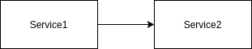  

ดูไปแล้วมันก็ง่ายดี แต่ถ้าระบบมีขนาดใหญ่ขึ้น การเชื่อมต่อกันระหว่าง Service จะเป็นแบบรูปนี้

  
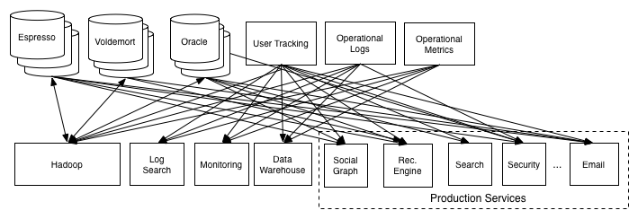

From [*The Log: What every software engineer should know about real-time data's unifying abstraction*](https://engineering.linkedin.com/distributed-systems/log-what-every-software-engineer-should-know-about-real-time-datas-unifying)

ระบบที่มีการเชื่อมต่อกันอย่างยุ่งเหยิงแบบนี้จะมีปัญหาคือ การดูแลรักษาระบบจะกลายเป็นเรื่องยากและใช้ Cost (กำลังคน และเวลา) สูงมาก  

Apache Kafka จะมาช่วยแก้ปัญหาเหล่านี้ โดยทำงานเป็น ตัวกลางของระบบ แบบรูปนี้

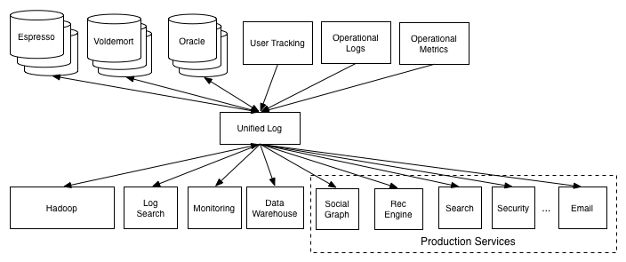  

From [*The Log: What every software engineer should know about real-time data's unifying abstraction*](https://engineering.linkedin.com/distributed-systems/log-what-every-software-engineer-should-know-about-real-time-datas-unifying)
ระบบรูปแบบนี้จะช่วยลดภาระการทำงานของ Service ให้เหลือเพียงแค่งานตามหน้าที่ของมันเท่านั้น หากจะติดต่อกับ Service ตัวอื่นก็แค่ส่งข้อมูลเข้าตัวกลางอย่าง Kafka แล้วปล่อยให้ Kafka จัดการส่งไปให้ Service ปลายทางเอง ทำให้แต่ละ Service เป็นอิสระต่อกันมากขึ้น สามารถปรับเปลี่ยนการทำงานได้ง่ายขึ้นกว่าเดิม

# หลักการทำงานของ Apache Kafka

## Publish/Subscribe

Apache Kafka เป็นระบบกระจายข้อมูลที่ทำงานแบบ **Publish-Subscribe** **(Pub-Sub)**

- จะมีตัวกลางที่ทำหน้าที่เป็นตัวรับและส่งข้อมูล ****เรียกว่า **Message Broker**

- ข้อมูลจะถูกเรียกว่า **Message,** **Event** หรือ **Record**

- Service ใด ๆ ที่ส่ง Message จะถูกเรียกว่า **Producer** โดย Producer ต้องกำหนด **Topic** กำกับที่ Message ก่อนส่งผ่าน Message Broker

- Service ที่รับ Message จะถูกเรียกว่า **Customer** ทำหน้าที่รับข้อมูลตาม Topic ที่ตนเองรับฟัง (Subscribe)  

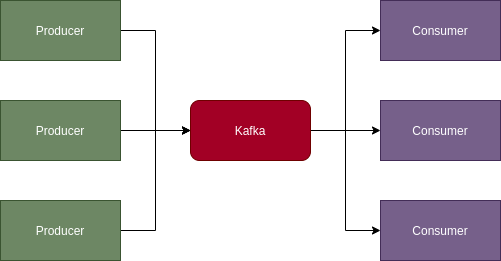

ภาพแสดงส่วนประกอบของ Kafka ที่เป็น Pub-Sub ตัวหนึ่ง
## Topics

**Topic** คือตัวที่ตั้งไว้ใช้เก็บ Message ที่จะส่งให้ Consumer ที่รับฟังอยู่ มีลักษณะเป็นโฟลเดอร์เก็บอยู่ภายใน Disk ใน Topic หนึ่งมีการแบ่งพื้นที่ออกเป็น **Partition** (จะพูดถึงในหัวข้อถัดไป) ที่มีโครงสร้างคล้าย Queue เมื่อ Kafka นำ Message เข้ามาเก็บใน Topic ตัวหนึ่ง Message จะถูกเขียนเป็นไฟล์ใน Topic นั้น เมื่อ Kafka ส่ง Message ไปให้ Customer เรียบร้อย ไฟล์นั้นจะถูกทำเครื่องหมายว่าอ่านแล้ว และจะถูกลบออกจาก Topic เมื่อถึงเวลาที่กำหนดไว้

Topic จะมี Consumer ได้หลาย Consumer ในเคสปกติ หาก Topic ใดที่มี Customer หลายตัว Subscribe อยู่ เมื่อมี Message เข้ามา Message นั้นจะถูกส่งไปให้ Customer ทุกตัว กลับกัน หาก Topic ใดที่มี Message ค้างอยู่และไม่สามารถนำส่งไปที่ Consumer ตัวใดได้เลย Message จะค้างอยู่ใน Topic นั้นจนกว่าจะถึงเวลาที่ลบออก

  
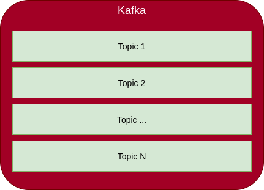

ภาพแสดงให้เห็นว่า Kafka เก็บ Topic ต่าง ๆ ไว้

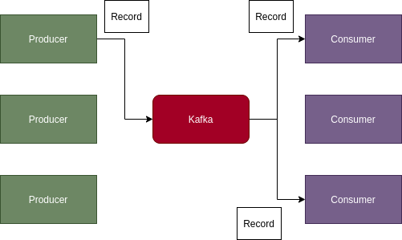  

ภาพแสดงการการส่ง Record และการรับ Record ใน Topic เดียวกัน
## Partition

Topics อาจมีขนาดใหญ่เกินไปจน Broker รับไม่ไหวหากมี Message เข้ามามาก ใน Kafka จึงได้มีการแบ่งพื้นที่ของ Topic ออกเป็น **Partition**

  

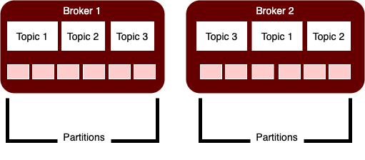

  
ลักษณะของ Partition

- มี Data Structure เป็น [**Log**](https://scaling.dev/storage/log)
- สามารถเก็บข้อมูลของหลาย Topic
- Partition สามารถอยู่ใน Broker เดียวกันหรือต่าง Broker ก็ได้ ถ้าอยู่คนละ Broker จะมีข้อดีหลายอย่าง
    - แบ่งเบาภาระของ Broker ตัวหนึ่ง
    - ถ้า Broker ตัวหนึ่งล่มและ Partition ในนั้นใช้การไม่ได้ ก็มีที่อยู่ใน Broker อื่นใช้งานได้อยู่
    - สามารถเก็บ Message สำรองไว้ใช้งานต่อไปได้

- Partition จะมี 2 ประเภทคือ Leader และ Replica
    1. **Leader** คือ Partition ที่ถูกเลือกให้มีการเปลี่ยนแปลงข้อมูลโดย Producer และอ่านข้อมูลโดย Consumer ได้
    2. **Replica** คือ Partition ตัวสำรอง ทำหน้าเก็บข้อมูลสำรองจาก Leader ตัว Replica ที่กำลัง Sync ข้อมูลกับ Leader อยู่จะเรียกว่า **In-Sync Replica (ISR)**

    - Leader Partition มีได้มากกว่าหนึ่งตัว
    - การคัดเลือก Leader และ Sync ข้อมูลเป็นหน้าที่ของ Service ที่มีชื่อว่า **"Zoo Keeper"**

    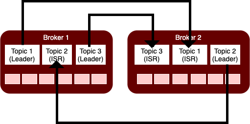

    ภาพแสดงความสัมพันธ์ของ Leader Partition และ Replica Partition แบบง่าย ๆ

## Log  

*Log is a persistent ordered data structure which only supports appends.*

Partition แต่ละตัวมีโครงสร้างการเก็บข้อมูลเป็น Log ที่มีลักษณะเป็นช่อง ๆ เรียงกัน เรียกว่า **Entry** เขียนเพิ่มได้อย่างเดียว ไม่สามารถแก้ไขหรือลบ Entry ที่เคยเพิ่มไปแล้วได้

การเขียนและการอ่านจะทำจากซ้ายไปขวาเพื่อให้ทำงานอย่างรวดเร็ว (Big O เป็น Linear)
แต่ละ Entry จะมีตัวเลขแสดงลำดับที่ของข้อมูลเหมือนกับ Array เรียกว่า **Offset**

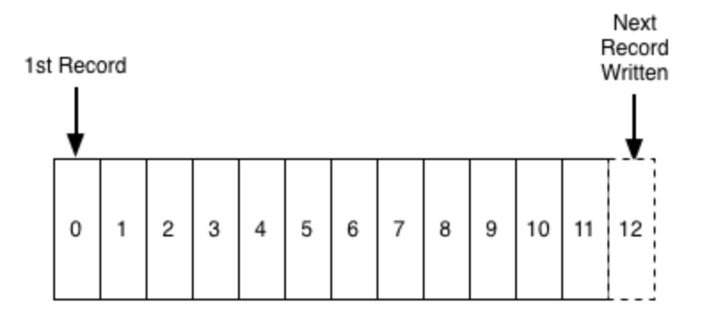

Log Structure; From [*The Log: What every software engineer should know about real-time data's unifying abstraction*](https://engineering.linkedin.com/distributed-systems/log-what-every-software-engineer-should-know-about-real-time-datas-unifying)  

ทั้งนี้ทั้งนั้นการเรียงลำดับของข้อมูลจะทำได้แค่ใน Partition ตัวใดตัวหนึ่งเท่านั้น ไม่ได้ทำกับ Partition ทั้งหมดที่อยู่ในวงเดียวกัน ดังนั้นหากมีการส่งข้อมูลหลายตัวใน Topic เดียวกัน แต่ข้อมูลไปเก็บอยู่ในคนละ Partition ทางฝั่ง Consumer จะอ่านข้อมูลเป็น Parallel ไม่ได้อ่านเรียงลำดับก่อนหลัง ลำดับที่ได้ขึ้นอยู่กับว่า Consumer จะอ่านจาก Partition ใดได้ไวกว่ากัน

แต่แน่นอนที่สุดถ้าใน Partition เดียวกัน ข้อมูลจะเรียงลำดับกัน ดังนั้นถ้าหากว่าต้องนำข้อมูลลำดับก่อนหลังไปใช้จริง ๆ จะต้องส่งข้อมูลไปที่ Partition ตัวเดียว โดยการเลือก Partition จะต้องระบุ Key ใน Message ที่จะส่งไป
## Producer

Producer เป็น Service ที่ทำหน้าที่เขียนข้อมูลลงใน Partition ในส่วนของ Topic ที่เราได้กำหนดไว้  
### Partition ที่จะเขียนลงไป

Producer จะต้องเขียนข้อมูลลงใน Leader Partition เท่านั้น
คำถามที่ตามมาก็คือ ในเมื่อ Topic เดียวกันมี Leader Partition มากกว่าหนึ่งได้ ในกรณีนี้จะทำอย่างไร?

คำตอบคือ เราสามารถกำหนด Partition ที่จะให้ Producer เขียนข้อมูลลงไปได้โดยระบุ **Message Key** เมื่อได้ Message Key มาแล้วจะมีการ Generate ค่า hash โดยใช้ Algorithm ที่เรียกว่า **murmur2** ค่า hash ที่ได้เหมือนเป็น ID ของ Partition ที่จะเก็บ แต่ถ้าหากไม่กำหนด Producer จะเลือก Partition เองโดยใช้หลักการ [Round-Robin](https://en.wikipedia.org/wiki/Round-robin_scheduling)
### ขั้นตอนการเขียน

1. Producer ส่งข้อมูลไปยัง Broker
2. Broker ทำการ commit ค่าของ Offset หรือตำแหน่งที่จะเขียนใน Partition ที่เลือกไว้
3. Broker เขียนข้อมูลลงไปใน Partition นั้น
4. ถ้ามีการกำหนดให้ส่ง Ack (Acknowledgement) Broker จะส่ง Ack กลับไปให้ Producer ด้วย
5. Zoo Keeper ทำการ Sync ข้อมูลกับ ISR


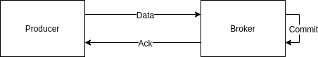

### Acknowledgement

เราสามารถกำหนดระดับของ Acknowledgement ได้ถึง 3 ระดับดังนี้  

- **0** - ให้ Producer **ไม่**รอ Ack จาก Broker ระดับนี้จะทำให้การส่งข้อมูลรวดเร็วที่สุด แต่มีข้อเสียคือจะเสี่ยงเกิดข้อมูลหายหรือ **Data Loss** เพราะ Producer จะไม่มีทางรู้ว่า ข้อมูลส่งไปสำเร็จหรือไม่?
- **1** -  ให้ Producer รอ Ack จาก Broker ระดับนี้เมื่อส่งข้อมูลไปยัง Leader Partition สำเร็จ Broker จะส่ง Ack ให้ Producer ทันที
- **-1 หรือ all** - ให้ Producer รอ Ack จาก Broker ที่จะเกิดขึ้น**เมื่อทั้ง Leader และ Replica มีข้อมูลตรงกัน** ระดับนี้หลังจากที่ข้อมูลถูกบันทึกลงใน Leader Partition แล้ว Broker จะรอให้มีการ Sync ข้อมูลจาก Leader ไปยัง ISR ทั้งหมด เมื่อ ISR แต่ละตัวตอบกลับมาว่าได้รับข้อมูลแล้ว Broker ค่อยส่ง Ack กลับมาที่ Producer ในระดับนี้จะการันตีได้ว่าข้อมูลจะไม่หายอย่างแน่นอน

ถ้าหากกำหนดระดับเท่ากับ 1 หรือ all และไม่ได้รับ Ack ภายในเวลาที่กำหนดไว้ Producer ก็จะ **Retry** ส่งข้อมูลเดิมอีกครั้ง จนกว่าสำเร็จ หรือครบจำนวนครั้งของการ Retry
ในกรณีที่ Broker เขียนข้อมูลไปแล้วแต่ Producer ส่งข้อมูลเดิมซ้ำเนื่องจากไม่ได้รับ Ack (Ack หายไประหว่างทาง) Broker จะทำการ Duplicate Commit (อาจทำให้ Consumer อ่านข้อมูลซ้ำได้)


## Consumer

Consumer คือ Service ที่ทำหน้าที่ตรงกันข้ามกับ Producer คือ อ่านข้อมูล มีการทำงานอธิบายอย่างง่ายก็คือ

1. Consumer อ่านข้อมูลจาก Leader Partition ถ้ามี Partition หลายตัว จะอ่านแบบขนาน (Parallel)
2. เมื่ออ่านเสร็จ Consumer จะ Commit ตำแหน่งที่อ่านหรือ Offset เพื่อให้ Kafka รู้ว่าข้อมูลถูก Process เรียบร้อยแล้ว

### Consumer Groups

โดยปกติ Consumer ที่อยู่ใน Topic เดียวกันจะอ่าน Partition ทั้งหมดที่เกี่ยวข้องกับ Topic  นั้น อาจทำให้ Consumer ต้องรับข้อมูลจำนวนที่มากเกินไป เราสามารถเพิ่มและจัดกลุ่ม Consumer ให้แต่ละตัวอ่าน Partition ตามที่ต้องการ โดยจัดให้จำนวน Consumer สัมพันธ์กับจำนวน Partition ที่มี

- ถ้าใน Group มี Consumer มากกว่า Partition จะมี Consumer ตัวหนึ่งในระบบไม่ทำงาน (Idle) เพราะว่า Consumer ตัวอื่นจอง Partition กันหมดแล้ว
- ถ้าใน Group มี Consumer น้อยกว่า Partition จะมี Consumer ไปอ่านข้อมูลหลาย Partition
- ถ้าใน Group มี Consumer เท่ากับ Partition แต่ละ Consumer จะอ่านข้อมูลจาก Partition เดียวแบบตัวต่อตัว


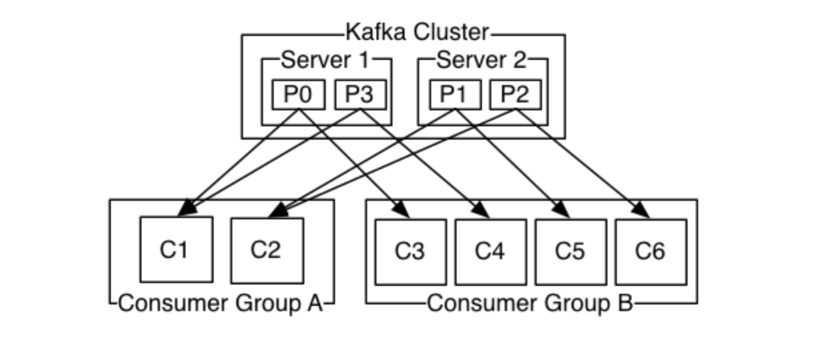

From: Introduction page of Apache Kafka — [https://kafka.apache.org/intro](https://kafka.apache.org/intro)

จากรูปสรุปได้ว่า

Server 1 มี Partition 0 กับ Partition 3 และ Server 2 มี Partition 1 กับ Partition 2
เรามี Consumer Group A และ B
Group A มี 2 Consumer และ Group B มี 4 Consumer
ตามจำนวนของ Consumer และ Partition แล้ว
Consumer ทุกตัวใน Group A จะอ่านข้อมูลจาก 2 Partition
Consumer ทุกตัวใน Group B จะอ่านข้อมูลจาก Partition เดียว
ในแต่ละ Group จะมีการระบุตำแหน่งที่อ่านหรือ Offset เป็นของตัวเองแยกกัน ถ้ามี Group เพิ่มมาอีก Group ใหม่นั้นจะเริ่มอ่านข้อมูลจาก Partition ตำแหน่งที่ 0 เสมอ

## Zoo Keeper

Zoo Keeper เป็น Service ที่ทำงานเป็นแกนกลางของ Apache Kafka ทำหน้าที่จัดการทุกอย่าง เช่น

- จัดการกับการเชื่อมต่อของ Broker แต่ละตัว
- จัดการกับรายการ Topic
- ช่วยจัดสรร Partition ให้กับแต่ละ Topic
- กำหนดว่า Producer ควรเขียนและ Consumer ควรอ่านข้อมูลได้มากสุดเท่าไร
- บันทึกว่า Consumer Group มี Consumer อยู่เท่าไร และมี Offset ที่ตำแหน่งใดแล้ว
- จัดการเลือก Leader Partition และคอย Sync ข้อมูลไปให้ ISR ถ้า Leader ตาย จะมีการเลือก Leader ใหม่จาก ISR ที่เชื่อมกับ Leader เก่าอยู่
- Access Control — User คนใดมีสิทธิ์เข้าถึงข้อมูลอย่างไรบ้าง?
## Quorum

Quorum คือกลุ่มของ Broker เราจะมีจำนวน Broker เท่าไรก็ได้ แต่ถ้าจะให้ระบบมีความคงทนต่อความผิดพลาดสูงต้องมีจำนวนมากกว่าหนึ่งตัว  ที่นิยมก็ให้มีจำนวนเป็นเลขคี่ตั้งแต่ 3 ตัวขึ้นไป เพราะระบบจะยังคงทำงานได้ ถึงแม้จะล่มไปจำนวนหนึ่งก็ตาม เช่น ถ้ามี 3 ถึงแม้จะล่มไป 2 ก็ยังมีเหลือตัวหนึ่งให้ระบบทำงานต่อไปได้อยู่
การกำหนดจำนวนนั้นไม่มีสูตรที่ตายตัว แต่มีสูตรอย่างง่ายคือ **2n - 1** โดยที่ n คือจำนวน Broker ที่ยอมให้ล่มได้ เมื่อคำนวณแล้วจะได้จำนวน Broker ที่ควรมี มีมากเท่าไรยิ่งดี แต่ต้องประเมิน Cost ที่เรามีอยู่ด้วย
Zoo Keeper ก็มี Quorum เป็นของตัวเองเช่นกัน แต่ไม่สัมพันธ์กับ Broker สักเท่าไร การกำหนดจำนวนก็ไม่ตายตัว ขึ้นอยู่กับการออกแบบระบบของเรา อาจจะให้มี Zoo Keeper 1-2 ตัวต่อหลาย Broker ก็ได้ หรือ จะจับคู่ 1 Zoo Keeper ต่อ 1 Broker ก็ทำได้เช่นกัน

## API

API ใน Kafka คือตัวกลางที่เปิดให้ Application ภายนอกติดต่อกับ Kafka ซึ่งมี API 4 ตัวดังนี้

1. **Producers API** — ให้ App ติดต่อกับ Producer เพื่อเขียนข้อมูล
2. **Consumers API** — ให้ App ติดต่อกับ Consumer เพื่ออ่านข้อมูล
3. **Streams API** —  ให้ App ดึงข้อมูลจาก Consumer และส่งข้อมูลกลับไปหา Producer
4. **Connector API** — ใช้จัดการการเชื่อมต่อของ Producer และ Consumer กับระบบอื่น หรือ Data System และเคลื่อนย้ายข้อมูลทั้งสองฝั่ง ความพิเศษของ API นี้คือสามารถเคลื่อนย้ายข้อมูลขนาดใหญ่จากภายนอก เช่น Database เข้ามาใน Topic ของ Kafka ได้เลย


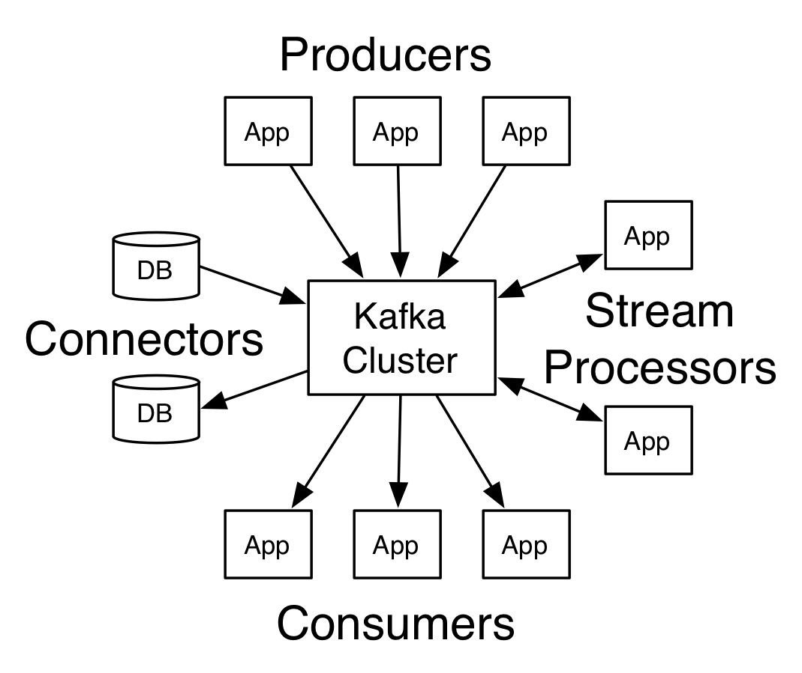


ภาพแสดงการทำงานของ API ทั้ง 4 ตัว From: Introduction page of Apache Kafka — [https://kafka.apache.org/intro](https://kafka.apache.org/intro)

# ลองทำดูเล่น ๆ

## การติดตั้งในเครื่อง

ในที่นี้จะติดตั้งผ่าน Docker Compose เพราะทำได้ง่ายกว่า วิธีการติดตั้งก็คือ ให้สร้างไฟล์ `docker-compose.yml` และวาง Config ตามข้างล่างนี้ลงไป

  
```yaml

networks:
    kafka-net:
        driver: bridge
services:
    zookeeper-server:
        image: bitnami/zookeeper:latest
        networks:
            - kafka-net
        ports:
            - 2181:2181
        environment:
            - ALLOW_ANONYMOUS_LOGIN=yes
    kafka-server-1:
        image: bitnami/kafka:latest
        networks:
            - kafka-net
        ports:
            - 9092:9092
            - 9093:9093
        environment:
            - KAFKA_CFG_ZOOKEEPER_CONNECT=zookeeper-server:2181
            - ALLOW_PLAINTEXT_LISTENER=yes
            - KAFKA_CFG_LISTENER_SECURITY_PROTOCOL_MAP=CLIENT:PLAINTEXT,EXTERNAL:PLAINTEXT
            - KAFKA_CFG_LISTENERS=CLIENT://:9092,EXTERNAL://:9093
            - KAFKA_CFG_ADVERTISED_LISTENERS=CLIENT://kafka-server-1:9092,EXTERNAL://localhost:9093
            - KAFKA_INTER_BROKER_LISTENER_NAME=CLIENT
        depends_on:
            - zookeeper-server
    kafka-ui:
        image: provectuslabs/kafka-ui
        ports:
            - 8081:8080
        networks:
            - kafka-net
        depends_on:
            - kafka-server-1
        environment:
            - KAFKA_CLUSTERS_0_NAME=local-test
            - KAFKA_CLUSTERS_0_BOOTSTRAPSERVERS=kafka-server-1:9092
            - KAFKA_CLUSTERS_0_ZOOKEEPER=zookeeper-server:2181

```

  
จากไฟล์นี้ เราจะสร้าง Service ทั้งหมด 3 อัน คือ `zookeeper-server`, `kafka-server-1` และ `kafka-ui`

Service แรก `zookeeper-server` จะทำหน้าที่เป็น Zoo Keeper ให้ Kafka ที่เราสร้างขึ้นต่อไป มันจะทำงานบน Port `2181` โดยปกติแล้วการที่จะเข้าถึง Zoo Keeper ได้นั้นจะต้องกำหนด username และ password แต่ในที่นี้เราสามารถติดต่อได้เลย เพราะว่ามี `ALLOW_ANONYMOUS_LOGIN=yes` ในส่วน environment แล้ว

Service ถัดมาคือ `kafka-server-1` จะเป็น Kafka Node หรือ Message Broker ที่ทำหน้าที่รับส่งข้อมูล

1. [https://hub.docker.com/r/bitnami/zookeeper/](https://hub.docker.com/r/bitnami/zookeeper/)
2. [https://hub.docker.com/r/bitnami/kafka/](https://hub.docker.com/r/bitnami/kafka/)
3. [https://itnext.io/how-to-install-kafka-using-docker-a2b7c746cbdc](https://itnext.io/how-to-install-kafka-using-docker-a2b7c746cbdc)
4. [Kafka Listeners - Explained | Confluent](https://www.confluent.io/blog/kafka-listeners-explained/)
## การใช้งานกับ Application

- [A Quick Guide to Spring Cloud Stream](https://developer.okta.com/blog/2020/04/15/spring-cloud-stream)
- [สร้าง Event-Driven Systems ด้วย Spring Cloud Stream และ Apache Kafka](https://developers.ascendcorp.com/%E0%B8%AA%E0%B8%A3%E0%B9%89%E0%B8%B2%E0%B8%87-event-driven-systems-%E0%B8%94%E0%B9%89%E0%B8%A7%E0%B8%A2-spring-cloud-stream-%E0%B9%81%E0%B8%A5%E0%B8%B0-apache-kafka-ee9fa845a8ed)
- [Realtime Chat app using Kafka, SpringBoot, ReactJS, and WebSockets](https://dev.to/subhransu/realtime-chat-app-using-kafka-springboot-reactjs-and-websockets-lc?fbclid=IwAR1gx6ymH5KGsZ8KU5uFZuMy5DvCM7d0-6SZ8W34U7p3Oh8ptCZTzL6X2ec)
# ที่มา & อ่านเพิ่มเติม

- [Apache Kafka](https://kafka.apache.org/intro)
- [Understanding Kafka - A Distributed Streaming Platform](https://medium.com/swlh/understanding-kafka-a-distributed-streaming-platform-9a0360b99de8)
- [The Log: What every software engineer should know about real-time data's unifying abstraction](https://engineering.linkedin.com/distributed-systems/log-what-every-software-engineer-should-know-about-real-time-datas-unifying)
- [Apache Kafka - Topics and Partitions explained](https://datatoolbox.wordpress.com/2017/09/19/apache-kafka-topics-and-partitions-explained/)
- [What does In-Sync Replicas in Apache Kafka Really Mean? - CloudKarafka, Apache Kafka Message streaming as a Service](https://www.cloudkarafka.com/blog/2019-09-28-what-does-in-sync-in-apache-kafka-really-mean.html)
- [Power of the Log: LSM & Append Only Data Structures](https://www.slideshare.net/ConfluentInc/power-of-the-loglsm-append-only-data-structures)
- [Kafka producer overview](https://www.linkedin.com/pulse/kafka-producer-overview-sylvester-daniel/)
- [Kafka Clients (At-Most-Once, At-Least-Once, Exactly-Once, and Avro Client) - DZone Big Data](https://dzone.com/articles/kafka-clients-at-most-once-at-least-once-exactly-o)
