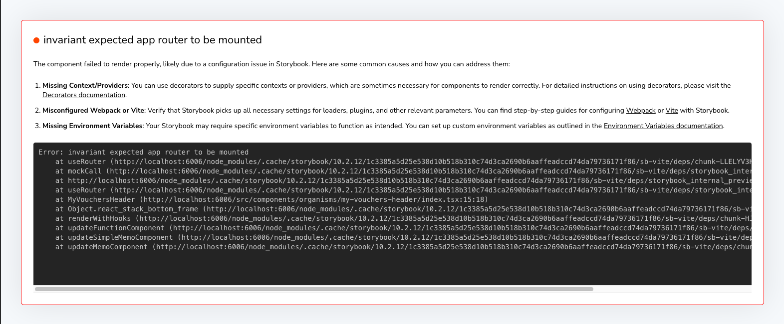
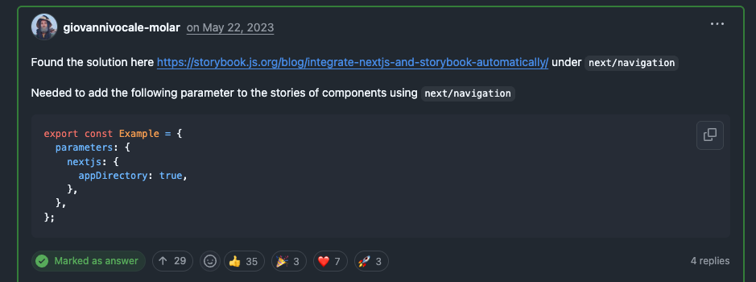

I created a [[storybook|Storybook]] story contains UI components which used `useNavigation` from Next.js inside. When I run storybook instance, it display error page instead:



In the [Next.js discussion](https://github.com/vercel/next.js/discussions), there is a [discussion](https://github.com/vercel/next.js/discussions/50068) which people talked about it, and I found a solution.



Luckily, I just recently updated Storybook to 10, so I can use this parameter to resolve this.

I added the parameter in `preview.ts` (or `.js`) in the folder `.storybook` to apply to all created components

```typescript
import { Preview } from '@storybook/nextjs-vite'

const preview: Preview = {
	...other options...
	parameters: {
		 ...other parameter...
		 nextjs: {
			 appDirectory: true,
		},
	},
}
export default preview
```